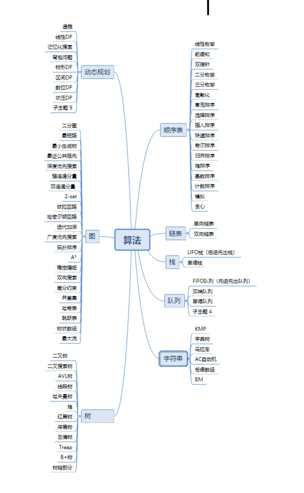
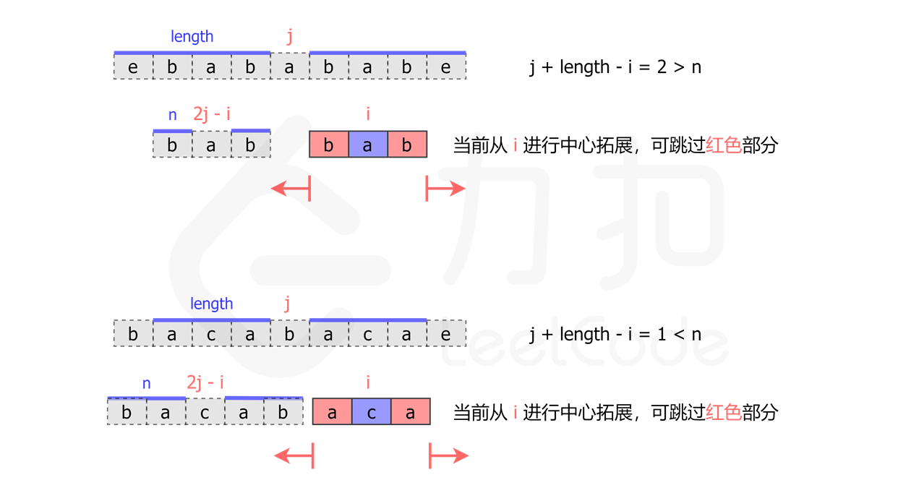

# 算法总结

---

### 图形总结:



---

### 1.顺序表

### 2.链表

### 3.栈

### 4.队列

### 5.字符串

#### 5.1.KMP算法

#### 5.2.字典树

#### 5.3.马拉车算法

> #### Manacher 算法
>
> 该算法主要用于计算字符串的回文串问题, 以中心拓展算法为基础,找出每个下标的回文臂长
>
> 为了表述方便，我们定义一个新概念臂长，表示中心扩展算法向外扩展的长度。如果一个位置的最大回文字符串长度为 2 * length + 1 ，其臂长为 length。
>
> 下面的讨论只涉及长度为奇数的回文字符串。长度为偶数的回文字符串我们将会在最后与长度为奇数的情况统一起来。
>
> 思路与算法
>
> 在中心扩展算法的过程中，我们能够得出每个位置的臂长。那么当我们要得出以下一个位置 i 的臂长时，能不能利用之前得到的信息呢？
>
> 答案是肯定的。具体来说，如果位置 j 的臂长为 length，并且有 j + length > i，如下图所示：
>
> 
>
> 当在位置 i 开始进行中心拓展时，我们可以先找到 i 关于 j 的对称点 2 * j - i。那么如果点 2 * j - i 的臂长等于 n，我们就可以知道，点 i 的臂长至少为 min(j + length - i, n)。那么我们就可以直接跳过 i 到 i + min(j + length - i, n) 这部分，从 i + min(j + length - i, n) + 1 开始拓展。
>
> 我们只需要在中心扩展法的过程中记录右臂在最右边的回文字符串，将其中心作为 j，在计算过程中就能最大限度地避免重复计算。
>
> 那么现在还有一个问题：如何处理长度为偶数的回文字符串呢？
>
> 我们可以通过一个特别的操作将奇偶数的情况统一起来：我们向字符串的头尾以及每两个字符中间添加一个特殊字符 #，比如字符串 aaba 处理后会变成 #a#a#b#a#。那么原先长度为偶数的回文字符串 aa 会变成长度为奇数的回文字符串 #a#a#，而长度为奇数的回文字符串 aba 会变成长度仍然为奇数的回文字符串 #a#b#a#，我们就不需要再考虑长度为偶数的回文字符串了。
>
> 注意这里的特殊字符不需要是没有出现过的字母，我们可以使用任何一个字符来作为这个特殊字符。这是因为，当我们只考虑长度为奇数的回文字符串时，每次我们比较的两个字符奇偶性一定是相同的，所以原来字符串中的字符不会与插入的特殊字符互相比较，不会因此产生问题。
>
> 代码:
>
> ```golang
> func longestPalindrome(s string) string {
>     start, end := 0, -1
>     t := "#"
>     for i := 0; i < len(s); i++ {
>         t += string(s[i]) + "#"
>     }
>     s = t
>     arm_len := []int{}
>     right, j := -1, -1
>     for i := 0; i < len(s); i++ {
>         var cur_arm_len int
>         if right >= i {
>             i_sym := j * 2 - i
>             min_arm_len := min(arm_len[i_sym], right-i)
>             cur_arm_len = expand(s, i-min_arm_len, i+min_arm_len)
>         } else {
>             cur_arm_len = expand(s, i, i)
>         }
>         arm_len = append(arm_len, cur_arm_len)
>         if i + cur_arm_len > right {
>             j = i
>             right = i + cur_arm_len
>         }
>         if cur_arm_len * 2 + 1 > end - start {
>             start = i - cur_arm_len
>             end = i + cur_arm_len
>         }
>     }
>     ans := ""
>     for i := start; i <= end; i++ {
>         if s[i] != '#' {
>             ans += string(s[i])
>         }
>     }
>     return ans
> }
> 
> func expand(s string, left, right int) int {
>     for ; left >= 0 && right < len(s) && s[left] == s[right]; left, right = left-1, right+1 { }
>     return (right - left - 2) / 2
> }
> 
> func min(x, y int) int {
>     if x < y {
>         return x
>     }
>     return y
> }
> ```

### 6.动态规划

### 7.图

### 8.树

