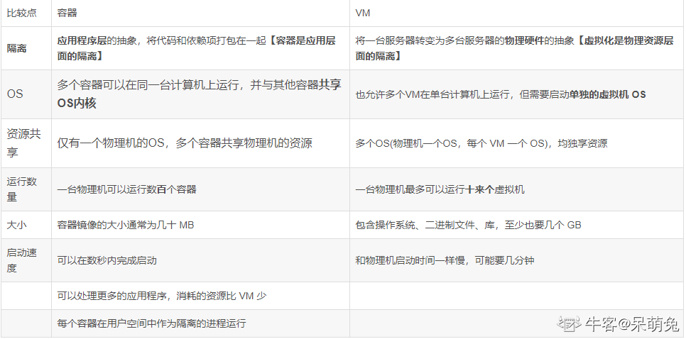

[TOC]

### 1.Docker 是什么？ 

是实现容器技术的一种工具    

是一个开源的应用容器引擎    

使用 C/S 架构模式，通过远程API 来管理    

可以打包一个应用及依赖包到一个轻量级、可移植的容器中   

### 2.容器是什么？  

对应用软件和依赖包进行标准打包      

应用或服务之间相互隔离，但又共享一个 OS      

可以打包运行在不同的系统上     

### 3.为什么会出现容器？  

为了解决单机部署应用和虚拟化的局限性而诞生  

### 4.虚拟化是什么？  

可以理解成虚拟机技术     

 一个主机可以部署多个虚拟机，每个虚拟机又可以部署多个应用      

对于主机来说，虚拟机就是一个普通文件     

### 5.虚拟化的缺点是什么？  

**资源占用多：**每个虚拟机都是完整的操作系统，需要给它分配大量系统资源      

**冗余步骤多：**一个完整的操作系统，一些系统级别的步骤无法避免，比如用户登录      

**启动慢：**启动操作系统需要多久，启动虚拟机就要多久     

### 6.Docker 有什么优势？  

**资源占用少：**每个容器都共享主机的资源，容器需要多少就用多少      

**启动快：**一条命令即可将容器启动，而容器启动时一般会将服务或应用一并启动     

### 7.Docker 和 虚拟化的区别？  

### 8.Docker 容器有几种在状态？  

starting 运行状态      

Exited 退出状态      

Paused 暂停状态      

healthy 健康状态      

unhealthy 非健康状态     

### 9.什么是仓库？  

存放镜像文件的地方，比如 DockerHub，可以将自己的镜像上传上去      

不同镜像可以有不同的标签      

主机可以从仓库下载镜像     

### 10.什么是镜像？  

创建容器的模板      

同一个镜像可以创建多个不同的容器     

### 11.什么是容器？  

通过镜像生成的运行实例      

不同容器之间是相互隔离，独立运行的      

通常一个容器就是一个应用或一个服务，也是我们常说的微服务     

### 12.仓库、镜像、容器的关系是？  

仓库存放镜像，主机通过仓库下载镜像，通过镜像创建容器  

### 13.有什么常用的 Docker 命令？  

> docker pull 拉取镜像
> docker create 创建容器
>
> docker rm 删除容器  
>
> docker ps 列出正在运行的容器列表
>
> docker run 创建容器并运行指定命令
> docker start 启动容器
> docker stop 停止运行容器
> docker restart 重启容器
> docker rm 删除容器
> docker exec 容器执行指定命令
> docker rmi 删除镜像

### 14.如何把主机的东西拷贝到容器内部？  

通过 docker cp 命令即可，还能把容器内部内容拷贝到主机  

### 15.进入容器的方法有哪些？  

通过 docker exec 进入容器内部

### 16.如何让容器随着 Docker 服务启动而自动启动？  

 创建容器时，加上 --restart=always 参数
 创建容器后，通过修改容器配置文件的 RestartPolicy 参数值
 创建容器后，使用 docker update 命令更新容器的 --restart 参数值

###  17.如何指定容器的端口映射？ 

创建容器**时**，通过 -p 来指定端口映射      

创建容器**后**，通过修改容器的配置文件来指定端口映射     

### 18.如何查看官方镜像服务的默认端口是什么？  

可以通过 docker inspect 查看镜像信息，然后找到端口映射一栏      

也可以先用该镜像创建一个容器并运行，通过 docker ps 查看运行端口是什么     

### 19.如何修改容器的端口映射？  

删除容器，重新创建容器，并指定端口映射      

通过容器配置文件修改端口映射      

通过 docker commit 将容器构建为一个全新的镜像，然后再通过该镜像创建新的容器，并指定端口映射     

### 20.如何指定容器的目录映射？  

创建容器**时**，通过 -v 来指定目录映射      

创建容器**后**，通过修改容器的配置文件来指定目录映射     

### 21.如何修改容器的目录映射？  

删除容器，重新创建容器，并指定目录映射      

通过容器配置文件修改目录映射      

通过 docker commit 将容器构建为一个全新的镜像，然后再通过该镜像创建新的容器，并指定目录映射     

### 22.K8S 是什么？  

容器集群管理系统，是一个开源的平台，可以实现容器集群的自动化部署、自动扩缩容、维护等功能  

快速部署应用      

快速扩展应用      

无缝对接新的应用功能      

节省资源，优化硬件资源的使用