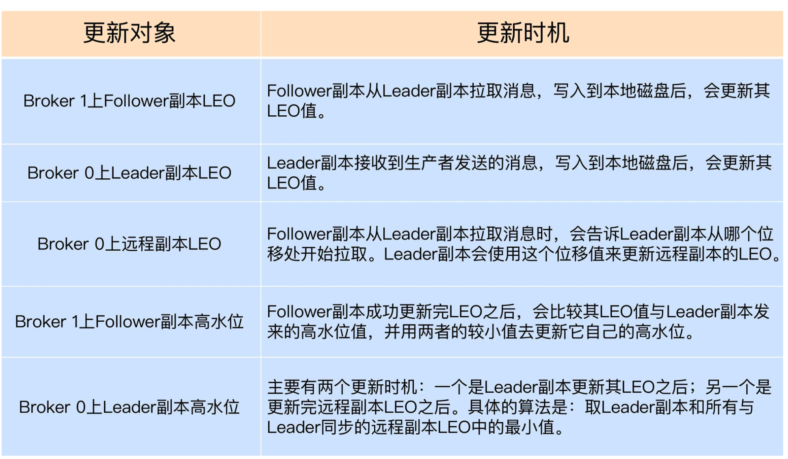

[TOC]

### 1.kafka是什么

Kafka是一种高性能、可扩展、分布式的消息中间件系统。它主要用于解决大规模数据处理时的消息传递问题，是一种典型的发布/订阅模式的消息队列系统。Kafka由LinkedIn开发，现已成为Apache软件基金会的顶级开源项目。

**优势:**

> 1. 高吞吐量和低延迟：Kafka能够处理数百万条消息，每秒钟处理几百MB数据的传输。Kafka采用了顺序读写磁盘的方式，而非随机读写，从而实现了高吞吐量和低延迟的特性。
> 2. 分布式架构和高可用性：Kafka的分布式架构使得它能够水平扩展，支持动态添加Broker节点。同时，Kafka采用多副本机制，确保数据的高可用性。
> 3. 多语言支持：Kafka的API支持多种编程语言，如Java、Scala、Python等。
> 4. 可靠性：Kafka采用多副本机制来确保数据的可靠性。在消息传递过程中，Kafka可以自动进行重试和恢复操作。
> 5. 消息持久化：Kafka将消息以日志的方式持久化在磁盘中，从而保证了消息的可靠性和持久性。
> 6. 灵活的数据处理模型：Kafka支持多种数据处理模型，如发布/订阅模式、队列模式、流处理模式等。
>
> 总之，Kafka是一个功能强大、高性能、可靠性高、可扩展性好的消息中间件系统，能够满足大规模数据处理的需求，被广泛应用于数据处理、日志处理、监控告警、消息推送等场景。

**使用场景:**

> 日志收集
>
> 消息系统
>
> 用户活动跟踪
>
> 运营指标
>
> 流式处理

**缺点:**

> 由于是批量发送，数据并非真正的实时
> 对于mqtt协议不支持
> 不支持物联网传感数据直接接入
> 仅支持统一分区内消息有序，无法实现全局消息有序
> 监控不完善，需要安装插件
> 依赖zookeeper进行元数据管理

### 2.基本概念

#### Broker

 Kafka服务器，负责消息存储和转发

#### Topic

消息类别，Kafka按照topic来分类消息

#### Partition

##### 功能

topic的分区，一个topic可以包含多个partition， topic 消息保存在各个partition上

##### 组成

partition中的每条Message包含了以下三个属性： 

> **offset**
>
> 表示Message在这个partition中的偏移量，offset不是该Message在partition数据文件中的实际存储位置，而是逻辑上一个值，它唯一确定了partition中的一条Message，可以认为offset是partition中Message的 id； 
>
> **MessageSize**
>
> 表示消息内容data的大小
>
> **data**
>
> Message的具体内容

##### 其他

> 在Kafka中，一个topic被分为多个partition，每个partition又被划分成多个segment。一个partition可以看作是一个有序的消息队列，每个消息都有一个在该partition内唯一的偏移量(offset)。
>
> 每个partition可以被多个broker所拥有，其中一个broker被指定为leader，其余broker为follower。当生产者向一个partition写入消息时，消息会被发送到partition的leader上，然后由leader将消息复制到该partition的所有follower上，以确保数据的可靠性和高可用性。在这个过程中，follower会定期从leader上拉取最新的消息，以保持与leader的数据同步。
>
> 消费者可以消费一个或多个partition的消息。当消费者向broker请求数据时，broker会返回最近一次消费的偏移量，并从该偏移量开始向消费者推送消息。消费者可以自由控制从哪个偏移量开始消费消息，以实现灵活的消费方式。
>
> Partition的优势主要有以下几点：
>
> 1. 提高并发性：Partition可以将一个大的topic划分为多个小的partition，这样不同的partition可以分配到不同的broker上进行处理，从而提高了Kafka的并发性能。
> 2. 增加可靠性：Partition的多副本机制可以保证数据的可靠性和高可用性。在某个broker宕机时，其他broker可以接管该broker的partition，从而保证整个Kafka集群的可用性。
> 3. 提供灵活性：Partition可以为不同的消费者提供不同的消费策略。消费者可以自由选择消费哪些partition，以及从哪个偏移量开始消费消息。
>
> 总之，Partition是Kafka实现高性能、可靠性、高可用性的关键机制之一，能够提高Kafka的并发性能和可靠性，为消息处理提供更为灵活的选择。

#### Segment

一个 segment 是一个可追加的文件，用于存储 Kafka 分区中的一部分消息。Kafka 将消息按照 topic 和 partition 进行组织，并将它们存储在一个或多个 segment 文件中。
每个 segment 文件包含一系列消息，这些消息按照它们的 offset（在 partition 中的位置）进行排序。每个 segment 文件都有一个开始和结束的 offset，这些 offset 标记了 segment 文件中包含的消息的范围。当 segment 文件到达预定的大小限制时，Kafka 将停止在该文件中写入新消息，并创建一个新的 segment 文件。
通过这种方式，Kafka 可以在一个分区中存储非常大量的数据，而不需要将所有数据存储在单个文件中。这使得 Kafka 能够高效地处理大量的消息，并且可以在消息流中以恒定的速度写入数据，而不会因为一个巨大的文件而导致写入性能下降。同时，Kafka 还可以根据需要删除旧的 segment 文件，从而释放磁盘空间。

#### Offset

消息在日志中的位置，可以理解是消息在partition上的偏移量，也是代表该消息的唯一序号

#### Replica

在Kafka中，每个partition都有多个副本(replica)，其中一个为leader副本，其余为follower副本。leader副本接收来自生产者的消息并将其写入磁盘，同时将消息复制到所有follower副本，以确保数据的可靠性和高可用性。当leader副本出现故障时，Kafka会从follower副本中选出一个新的leader副本，从而保证整个集群的可用性。

#### Producer

消息生产者

#### Consumer

消息消费者

#### Consumer Group

消费者分组，每个Consumer必须属于一个消费组(Consumer group)

#### Zookeeper

负责broker故障发现， partition leader选举，负载均衡等功能

保存着集群 broker、 topic、 partition等meta 数据  (从Kafka 0.9版本开始，Kafka引入了新的元数据管理协议，称为Kafka Metadata Protocol，用于取代ZooKeeper成为Kafka的协调服务。)

> 从Kafka 0.9版本开始，Kafka不再依赖ZooKeeper来存储主题的元数据信息，而是将主题元数据信息保存在Kafka集群中的一个内置的Kafka主题中，这个主题的名称为`__consumer_offsets`。这个主题的元数据信息包含了每个分区的分配信息，以及分区的副本分配信息。
>
> 在Kafka 0.9版本及以后的版本中，ZooKeeper只被用作Kafka集群的协调服务，用于存储Kafka集群的一些配置信息，例如Broker的地址信息、Topic的分区分配方案等，以及用于选举Kafka集群的控制器（Controller）。与主题数据不同，这些元数据信息不是以Kafka的方式存储在一个特定的Kafka主题中，而是存储在ZooKeeper的节点上，由ZooKeeper进行管理和同步。

### 3.kafka的高效读取(顺序读写、分段命令、二分查找)

Kafka为每个分段后的数据文件建立了索引文件，文件名与数据文件的名字是一样的，只是文件扩展名为index。 index文件中并没有为数据文件中的每条Message建立索引，而是采用了稀疏存储的方式，每隔一定字节的数据建立一条索引。这样避免了索引文件占用过多的空间，从而可以将索引文件保留在内存中。

### 4.kafka怎么保证顺序消费

同一个分区的数据都是顺序的, 可以使用单分区

同一个key的消息会被分配到用一个分区, 可以保证顺序

### 5.如何保证不丢失数据

生产阶段: ack机制

消费阶段: 手动提交

#### ack机制

request.required.acks 有三个值 0 1 -1(all)，具体如下：

> 0：生产者不会等待 broker 的 ack，这个延迟最低但是存储的保证最弱当 server 挂掉的时候就会丢数据。
> 1：服务端会等待 ack 值 leader 副本确认接收到消息后发送 ack 但是如果 leader挂掉后他不确保是否复制完成新 leader 也会导致数据丢失。
> -1(all)：服务端会等所有的 follower 的副本受到数据后才会受到 leader 发出的ack，这样数据不会丢失。

### 6.如何保证不重复消费

**生产者**

kafka幂等校验

> 添加唯一ID，类似于数据库的主键，用于唯一标记一个消息。
> ProducerID：#在每个新的Producer初始化时，会被分配一个唯一的PID
> SequenceNumber：#对于每个PID发送数据的每个Topic都对应一个从0开始单调递增的SN值

**消费者**

手动提交

再均衡监听器

前两者还是会可能导致重复消费, 最好的办法是业务侧自己保证幂等(如, 唯一ID)

### 7.ISR(InSyncRepli)、OSR(OutSyncRepli)、AR(AllRepli)

kafka中与leader副本保持一定同步程度的副本（包括leader）组成ISR

与leader滞后太多的副本组成OSR

分区中所有的副本通称为AR

> ISR : 速率和leader相差低于10秒的follower的集合
> OSR : 速率和leader相差大于10秒的follower
> AR : 全部分区的follower

其中, 主副本宕机时, 会从isr中选取副本重新充当主副本

### 8.kafka如何保证高可用

**副本机制**

Kafka允许同一个Partition存在多个消息副本，每个Partition的副本通常由1个Leader及0个以上的Follower组成，生产者将消息直接发往对应Partition的Leader，Follower会周期地向Leader发送同步请求

同一Partition的Replica不应存储在同一个Broker上，因为一旦该Broker宕机，对应Partition的所有Replica都无法工作，这就达不到高可用的效果

所以Kafka会尽量将所有的Partition以及各Partition的副本均匀地分配到整个集群的各个Broker上

**ISR机制**

当一个partition的主副本节点宕机,会在isr集合中,寻找最新的副本充当主副本

**领导者机制**

如果ISR集合中没有副本, 或者全部宕机时, 会根据unclean.leader.election.enable配置, 判断是否开启领导者选举

true: 选举isr之外的副本, 此时会丢失一部分数据, 但任然保证系统可用

false: 分区停止服务, 直到ISR中有可用副本, 保证了数据一致性, 牺牲可用性

**Controller机制**

集群中的Controller也会出现故障，因此Kafka让所有Broker都在ZooKeeper的Controller节点上注册一个Watcher

Controller发生故障时对应的Controller临时节点会自动删除，此时注册在其上的Watcher会被触发，所有活着的Broker都会去竞选成为新的Controller(即创建新的Controller节点，由ZooKeeper保证只会有一个创建成功)

竞选成功者即为新的Controller

> Controller是Kafka中一种特殊的Broker节点，它负责管理集群中的元数据和分区副本的分配、删除、重新分配等操作。具体来说，Controller主要负责以下几个方面：
>
> 1. 分区副本的分配和重新分配。Controller会监控集群中每个Broker节点的存活状态，当某个Broker节点宕机或新增时，Controller会根据一定的算法重新计算分区副本的分配，以保证分区的可用性和负载均衡。
> 2. 分区副本的状态同步。当一个副本被选举为Leader或者从Leader副本同步数据时，Controller会负责维护分区副本的状态，以确保副本间数据的一致性。
> 3. 元数据的管理。Controller会将集群中所有Broker的元数据信息存储在Zookeeper中，并提供元数据查询接口，供其他节点查询。
> 4. Topic的创建、删除和配置修改。Controller还负责监控Topic的创建、删除和配置修改等操作，并将这些操作同步到集群中的其他Broker节点上。

### 9.分区Leader选举策略有几种？

> 分区的Leader副本选举对用户是完全透明的，它是由Controller独立完成的。具体有以下场景
>
> 1、 OfflinePartition Leader选举：每当有分区上线时，就需要执行Leader选举。所谓的分区上线，可能是创建了新分区，也可能是之前的下线分区重新上线。这是最常见的分区Leader选举场景。
>
> 2、 ReassignPartition Leader选举：当你手动运行Kafka-reassign-partitions命令，或者是调用Admin的alterPartitionReassignments方法执行分区副本重分配时，可能触发此类选举。假设原来的AR是[1，2，3]，Leader是1，当执行副本重分配后，副本集合AR被设置成[4，5，6]，显然，Leader必须要变更，此时会发生Reassign Partition Leader选举。
>
> 3、 PreferredReplicaPartition Leader选举：当你手动运行Kafka-preferred-replica-election命令，或自动触发了Preferred Leader选举时，该类策略被激活。所谓的Preferred Leader，指的是AR中的第一个副本。比如AR是[3，2，1]，那么，Preferred Leader就是3。
>
> 4、 ControlledShutdownPartition Leader选举：当Broker正常关闭时，该Broker上的所有Leader副本都会下线，因此，需要为受影响的分区执行相应的Leader选举。
>
> 这4类选举策略的大致思想是类似的，即从AR中挑选首个在ISR中的副本，作为新Leader。

### 10.kafka如何保证数据一致性

**HighWaterMark机制**

 **LEO(log end offset)：**

记录日志的末端位移值，即数据写到的最新的位置, 所有副本的最大偏移量.

**HW(high watermark)：**

Committed 过的最新数据。也就是所有副本中已经提交中的偏移量中最小的一个.

consumer 最多只能消费到 HW 所在的位置，因为小于等于 HW 值的数据才是 Committed 备份过的。

**更新时机**



### 11.kafka 发送一条消息 到 服务端的流程

> 1. 生产者将消息写入缓存：生产者将消息写入发送缓存中。这个缓存是一个循环队列，消息首先被写入队列的末尾，然后在队列中循环移动，直到被发送到服务端。
> 2. 消息分区：生产者根据消息的key或者round-robin等算法将消息分配到特定的分区中。分区是Kafka中数据的基本单位，每个分区对应一个在服务端上的日志文件。
> 3. 消息序列化：生产者将消息的key和value进行序列化。Kafka支持多种序列化格式，包括字符串、JSON、Avro、Protobuf等。
> 4. 网络传输：生产者将序列化后的消息通过TCP协议发送给Kafka集群中的Broker。生产者通过配置的Broker列表向其中一个Broker发送请求，该Broker将消息写入对应分区的日志文件中，并将消息的偏移量返回给生产者。
> 5. 确认发送：生产者收到Broker返回的确认消息后，将消息从发送缓存中删除。如果生产者没有收到确认消息，则会在一定时间内进行重试。
> 6. 服务端持久化：当Broker接收到消息后，它将消息写入对应分区的日志文件中。每个分区的日志文件被划分成多个大小固定的段（segment），每个段包含一定数量的消息。当一个段被写满后，它将被关闭并被移到磁盘上的归档日志目录中。为了提高消息的读写效率，Kafka采用了一种称为mmap的技术，通过内存映射文件来实现高效的读写操作。

### 12.消费者去服务端消费一条消息的流程

> 1. 消费者向Kafka集群请求消费：消费者向Kafka集群中的Broker发送拉取请求（pull request），请求从指定的主题（topic）和分区（partition）中拉取消息。消费者会告知Broker它要从哪个偏移量（offset）开始拉取消息，以及拉取多少条消息。
> 2. 服务端处理请求：当Broker接收到消费者的拉取请求后，它会查找对应分区的日志文件，定位到请求的偏移量，并从该偏移量开始读取指定数量的消息。如果Broker在指定的时间内没有收到足够的消息，则会返回空响应给消费者。
> 3. 网络传输：Broker将读取的消息序列化后通过TCP协议发送给消费者。消息在传输过程中可以进行压缩和加密操作。
> 4. 消息反序列化：消费者接收到消息后进行反序列化，将消息还原为原始的key和value。
> 5. 处理消息：消费者对收到的消息进行处理，如写入数据库、打印日志等。
> 6. 确认消费：消费者处理完一条消息后，会将该消息的偏移量提交给Broker，表示已经消费完了该消息。Kafka中的偏移量是消费者用来标识消费进度的关键指标，通过偏移量可以知道消费者消费到哪里了。消费者可以选择在每消费一条消息后立即提交偏移量，也可以缓存多条消息后批量提交，具体实现方式取决于消费者的应用场景和性能要求。

### 13.Rebalance

#### 1.Rebalance是什么

​    Rebalance就像他的名称一样，意思是再平衡，平衡什么？平衡**消费者**和**分区**之间的对应关系。本质上来讲，Rebalance是一种协议，规定了一个Consumer Group下所有Consumer如何达成一致，来分配订阅[Topic](https://so.csdn.net/so/search?q=Topic&spm=1001.2101.3001.7020)的每个分区，尽量让每个消费者分配到相对均匀的分区，使Consumer的资源都能得到充分利用，防止有些Consumer比较忙，有的Consumer比较闲。

#### 2.Rebalance触发的时机

​    当[kafka](https://so.csdn.net/so/search?q=kafka&spm=1001.2101.3001.7020)感知到存在让**分区和消费者分配不均匀**的事情发生时，就会触发Rebalance，来保证分区和消费者再次平衡。那么那些事情会触发Rebalance呢？或者说那些事情会导致分区和消费者分配不均匀呢？主要有三种：

1. **消费者组消费的分区个数发生变化。**
2. **消费者组消费的主题个数发生变化。**
3. **消费者组内的消费者个数发生变化。**

​    其实第2种情况，本质上是第1种情况的一个特例，消费组消费的主题个数发生变化，体现到消费组中的消费者身上，就是费配到消费者上的分区个数发生了变化。

#### 3.Rebalance的执行流程

理解Rebalance的流程，需要先了解一下**消费组协调者**。

​    协调者(Coordinator)是broker进程中的一个组件，每一个broker都会有一个Coordinator，协调者的职责在于：服务ConsumerGroup，完成整个Rebalance的过程，提供Consumer Group位移的管理，以及组内成员的管理。

这里有几个需要注意的问题：
**1.Consumer Group如何知道哪个协调者是为自己服务的？**
    Consumer Group的位移保存在__consumer_offset主题的某个partition中，这个partition是 hash(group_id)%50(__consumer_offset主题有50个分区)，然后这个partition的leader副本所在的broker上的coordintor就是该Consumer Group的协调者。

**2.协调者如何管理组成员？**
    当Consumer启动的时候，会向协调者所在broker发送多种请求，其中包含一个**Join Group**的请求，收到请求后，协调者执行消费者组的注册，消费者元数据信息保存。同时组中的各个消费者，都会定时的向协调者发送[心跳](https://so.csdn.net/so/search?q=心跳&spm=1001.2101.3001.7020)请求，让协调者了解每个消费者的状态信息。

​    当协调者发现某个消费者长时间没有发送心跳，那么协调者就会认为这个消费者挂了，把这个消费者从消费者组中剔除出去，然后在其他Consumer的心跳请求中回复 **Rebalance_need**,让每个消费者停止消息消费，并开启Rebalance。

​    当各个消费者收到**Rebalance_need**响应后，都会停止消息消费，并向协调者发送 SyncGroup请求，来询问分配给自己的分区信息。

#### 4.分区分配的策略有哪些

​    分配策略是指：当Rebalance触发时，重新将分区分配给消费者的方式。常用的分区方式有三种：**Range**，**RoundRobin** 和 **StickyAssignor**。

​    为了方便描述分区分配的流程，我们假设以下场景：一个消费组中有3个消费者，分别为Consumer_1,Consumer_2和Consumer_3。消费7个分区，分别为partition_0-7。

1. Range分配策略是指按照分区号的范围进行分区分配。
2. RoundRobin分配策略是指轮训每个分区，将分区逐个分配给消费者
3. StickyAssignor分区策略，又称为粘性分配，所谓的有粘性，是指每次 Rebalance 时，该策略会尽可能地保留之前的分配方案，尽量实现分区分配的最小变动。

​    例如实例Consumer1之前负责消费分区 0、1、2，那么 Rebalance 之后，如果可能的话，最好还是让实例 Consumer1 继续消费分区0、1、2，而不是被重新分配其他的分区。这样的话，实例 Consumer1 连接这些分区所在 Broker 的 TCP 连接就可以继续用，不用重新创建连接其他 Broker 的 Socket 资源。

不过这个分配策略要到 kafka 0.11版本才可以使用。

#### 5.Rebalance产生的影响

Rebalance产生的影响主要有两个：

##### 1.影响消费效率。

​    因为发生Rebalance时，所有消费者都会停止消费，比较影响消息消费效率，当一个消费组中消费者比较多的时候，Rebalance的过程会比较耗时。

##### 2.可能会产生消息重复消费

​    因为Consumer消费分区消息的offset提交过程，不是实时的(以offset自动提交为例)，由参数auto.commit.interval.ms控制提交的最小频率，默认是5000，也就是最少每5s提交一次。我们试想以下场景：提交位移之后的 3 秒发生了 Rebalance ，在 Rebalance 之后，所有 Consumer 从上一次提交的位移处继续消费，但该位移已经是 3 秒前的位移数据了，故在 Rebalance 发生前 3 秒消费的所有数据都要重新再消费一次。虽然可以通过减少 auto.commit.interval.ms 的值来提高提交频率，但这么做只能缩小重复消费的时间窗口，不可能完全消除它。

很遗憾的是，目前kafka社区对于Rebalance带来的影响，也没有彻底的解决办法。只能通过避免不必要的Rebalance，来降低Rebalance产生的影响。

#### 6.减少Rebalance的产生

​    有些时候，Rebalance是不可避免的，比如在运维过程中，为了增加客户端的处理能力，需要增加partition个数或者consumer个数，那么不可避免的需要触发Rebalance。

​    但是有些时候可能有些参数配置的问题，会导致一些不必要的Rebalance的发生，这些Rebalance的发生主要就是协调者错误的认为消费者实例挂了，然后触发Rebalance。

有哪些参数配置异常，会导致协调者认为消费者实例挂了呢？

1.session.timeout.ms

​    这个参数是协调者最长等待消费者没有发送心跳的时间间隔，如果协调者在该参数指定的时间内没有收到某个消费者的心跳请求，那么就认为该消费者挂了，就会将这个消费者从组里面剔除，然后触发Rebalance。

​    同时参数**heartbeat.interval.ms**,表示消费者向协调者发送心跳请求的时间间隔，这个参数设置的过大，会导致消费者长时间不会向协调者发送心跳，同时协调者向消费者发送的 Rebalance的消息也会不及时(协调者不是主从向消费者发送Rebalance消息的，而是将Rebalance消息封装到消费者心跳请求的响应消息中)。设置的小一些，消息会及时一些，但是，可能会消耗过多的带宽。

通常在生产环境中保证session.timeout.ms >= 3 * heartbeat.interval.ms。

2.max.poll.interval.ms

​    消费者调用poll方法的时间间隔，如果时间间隔大于该参数的设置，会认为这个Consumer存在问题(消息处理效率低，消费者可能不健康)，那么Consumer会向协调者发送 **leaveGroup**请求，自动退出消费者组，此时消费者数量发生变化，触发Rebalance。

​    在业务中，该参数可以设置的长一些，但是也不要违背了该参数的初衷(kafka对消费者的一种优胜劣汰的优化机制，poll的慢导致消息堆积)。因为业务上的确可能存在一些耗时的操作，或者poll拉去的消息过多，导致消息处理的慢，进而导致poll方法消息拉去的时间间隔过长，对于这种情况可以调整每次拉去消息个条数，或者优化消息处理逻辑，加快消息处理效率。

### 14.其他问题

#### 1.kafka的消费者是pull(拉)还是push(推)模式，这种模式有什么好处？

Kafka 遵循了一种大部分消息系统共同的传统的设计：producer 将消息推送到 broker，consumer 从broker 拉取消息。

优点：pull模式消费者自主决定是否批量从broker拉取数据，而push模式在无法知道消费者消费能力情况下，不易控制推送速度，太快可能造成消费者奔溃，太慢又可能造成浪费。

缺点：如果 broker 没有可供消费的消息，将导致 consumer 不断在循环中轮询，直到新消息到到达。为了避免这点，Kafka 有个参数可以让 consumer阻塞知道新消息到达(当然也可以阻塞知道消息的数量达到某个特定的量这样就可以批量发送)。

#### 2.kafka维护消息状态的跟踪方法

Kafka中的Topic 被分成了若干分区，每个分区在同一时间只被一个 consumer 消费。然后再通过offset进行消息位置标记，通过位置偏移来跟踪消费状态。相比其他一些消息队列使用“一个消息被分发到consumer 后 broker 就马上进行标记或者等待 customer 的通知后进行标记”的优点是，避免了通信消息发送后，可能出现的程序奔溃而出现消息丢失或者重复消费的情况。同时也无需维护消息的状态，不用加锁，提高了吞吐量。

#### 3.zookeeper对于kafka的作用是什么?

Zookeeper 主要用于在集群中不同节点之间进行通信，在 Kafka 中，它被用于提交偏移量，因此如果节点在任何情况下都失败了，它都可以从之前提交的偏移量中获取，除此之外，它还执行其他活动，如: leader 检测、分布式同步、配置管理、识别新节点何时离开或连接、集群、节点实时状态等等。

#### 4.kafka判断一个节点还活着的有那两个条件？

节点必须维护和 ZooKeeper 的连接，Zookeeper 通过心跳机制检查每个节点的连接
如果节点是个 follower,他必须能及时的同步 leader 的写操作，延时不能太久

#### 5.Kafka的哪些设计让它有如此高的性能

1.kafka是分布式的消息队列
2.对log文件进行了segment,并对segment创建了索引
3.(对于单节点)使用了顺序读写,速度能够达到600M/s
4.引用了zero拷贝,在os系统就完成了读写操做

### 15.kafka安装

**首先创建一个网络**

> app-tier：网络名称
> –driver：网络类型为bridge

```shell
docker network create app-tier --driver bridge
```

**安装zookeeper**

> Kafka依赖zookeeper所以先安装zookeeper
> -p：设置映射端口（默认2181）
> -d：后台启动

```shell
docker run -d --name zookeeper-server \
    --network app-tier \
    -e ALLOW_ANONYMOUS_LOGIN=yes \
    bitnami/zookeeper:latest
```

**查看zookeeper容器日志（可省略）**

```shell
docker logs -f zookeeper
```

**安装Kafka**

> 安装并运行Kafka，
> –name：容器名称
> -p：设置映射端口（默认9092 ）
> -d：后台启动
> ALLOW_PLAINTEXT_LISTENER任何人可以访问
> KAFKA_CFG_ZOOKEEPER_CONNECT链接的zookeeper
> KAFKA_ADVERTISED_HOST_NAME当前主机IP或地址（重点：如果是服务器部署则配服务器IP或域名否则客户端监听消息会报地址错误）
> -e KAFKA_CFG_ADVERTISED_LISTENERS=PLAINTEXT://10.0.4.10:9092 \

```shell
docker run -d --name kafka-server \
    --network app-tier \
    -p 9092:9092 \
    -e ALLOW_PLAINTEXT_LISTENER=yes \
    -e KAFKA_CFG_ZOOKEEPER_CONNECT=zookeeper-server:2181 \
    -e KAFKA_CFG_ADVERTISED_LISTENERS=PLAINTEXT://10.0.4.10:9092 \
    bitnami/kafka:latest
```

```shell
// 查看日志
docker logs -f kafka
```

**kafka-map图形化管理工具**

> 图形化管理工具
> 访问地址: http://121.4.33.56:9001/
> DEFAULT_USERNAME：默认账号admin
> DEFAULT_PASSWORD：默认密码admin
> Git 地址：https://github.com/dushixiang/kafka-map/blob/master/README-zh_CN.md

```shell
docker run -d --name kafka-map \
    --network app-tier \
    -p 9001:8080 \
    -v /data/kafka-map/data:/usr/local/kafka-map/data \
    -e DEFAULT_USERNAME=admin \
    -e DEFAULT_PASSWORD=admin \
    --restart always dushixiang/kafka-map:latest
```

