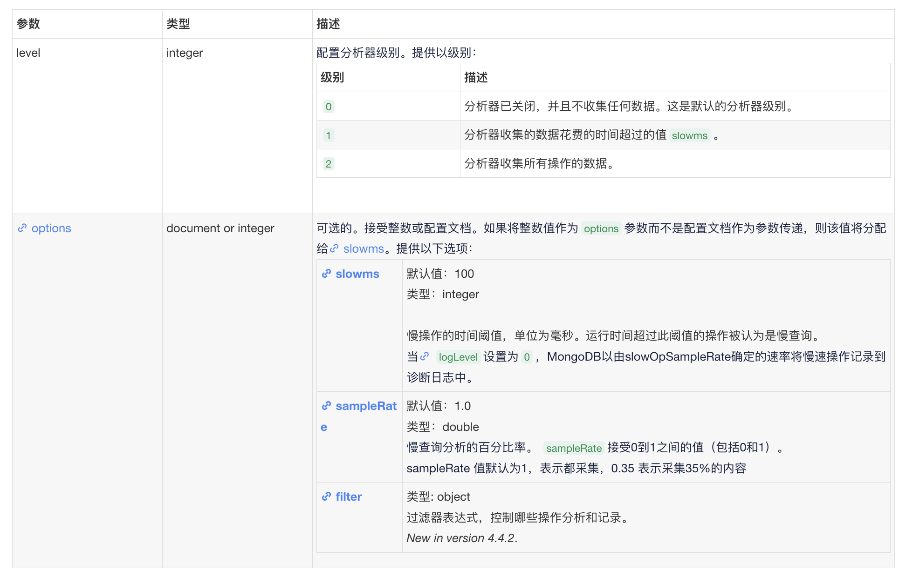
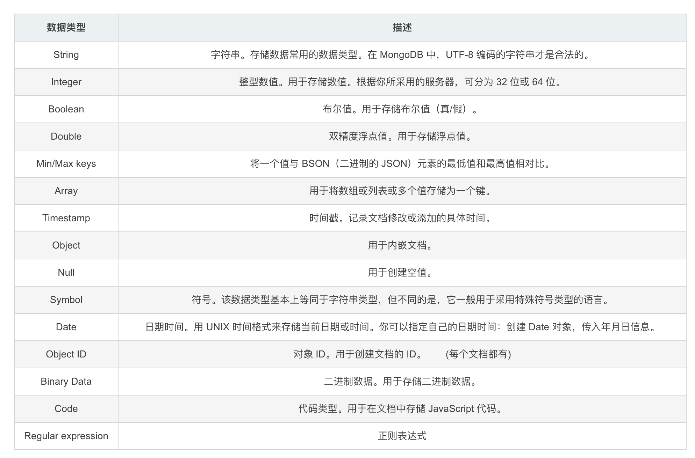

[TOC]

### 1.什么是非关系型数据库

> 非关系型数据库（NoSQL）是一种与传统关系型数据库不同的数据库类型，它不使用固定的表格模式和SQL语言，而是采用更加灵活的数据模型，如键值对、文档、图形等，以适应不同类型和结构的数据。NoSQL数据库在处理非结构化和半结构化数据方面非常擅长，这些数据可能难以用传统的关系型数据库进行处理。
>
> NoSQL数据库通常设计为高可扩展性、高性能和高可用性，因此它们在大数据处理和云计算应用中变得越来越流行。NoSQL数据库可以分布式存储和处理海量数据，以及支持快速的数据访问和查询，而且不需要复杂的事务处理，这使得NoSQL数据库适合用于大型Web应用、社交网络、物联网和其他大规模数据的应用场景。

### 2.什么是MongoDB

> MongoDB是一种非关系型的NoSQL数据库系统，它使用文档模型来存储数据。MongoDB是一款开源的数据库，它在处理大规模的、高可用性的分布式数据时非常有优势。它具有高性能、高可扩展性、灵活的数据模型以及强大的查询和聚合功能。
>
> MongoDB的数据存储在文档中，每个文档都是一个键值对的集合，可以包含多个字段和嵌套的文档。MongoDB支持丰富的查询语言，如聚合管道和地理空间查询等，同时还支持全文本搜索。MongoDB也具有良好的扩展性，可以通过水平扩展来增加性能和容量，同时保持数据的一致性和可用性。
>
> MongoDB采用BJSON存储文档数据。是一种类json的一种二进制形式的存储格式，简称Binary JSON.
> 相对于json多了date类型和二进制数组。

### 3.什么是Bson

>BJSON（Binary JSON）是一种二进制格式的JSON，用于在不同的应用程序和平台之间传输和存储JSON数据。与标准的JSON格式相比，BJSON使用更紧凑的二进制格式来表示数据，因此可以更快地进行解析和序列化。
>
>BJSON使用了一些优化技术来减少数据的大小和解析时间，例如：
>
>1. 使用变长整数来表示数值，减少了数值所占的空间；
>2. 使用字节标记来表示数据类型，可以更快地进行解析；
>3. 通过在数组和对象中使用连续的内存块来减少指针和空间开销。
>
>BJSON是一个相对较新的格式，但已经得到了许多数据库和应用程序的支持，例如MongoDB和Couchbase等NoSQL数据库。它还支持在多种编程语言中进行解析和序列化，如Java、C#、Python、Node.js等。
>
>
>
>和json的主要区别就是, json序列化成字符串, 但是bjson序列化成二进制

### 4.MongoDB的优势有哪些

> 面向文档的存储：以 JSON 格式的文档保存数据。
> 任何属性都可以建立索引。
> 复制以及高可扩展性。
> 自动分片。
> 丰富的查询功能。
> 快速的即时更新。
> 3 什么是数据库
> 　　数据库可以看成是一个电子化的文件柜,用户可以对文件中的数据运行新增、检索、更新、删除等操作。数据库是一个
> 所有集合的容器，在文件系统中每一个数据库都有一个相关的物理文件。

### 5.什么是文档(Document)

>在MongoDB中，文档（Document）是最基本的数据单元，它是一个由字段（Field）和值（Value）组成的键值对集合。文档可以包含任意数量的字段，每个字段都可以存储不同类型的数据，例如字符串、数字、布尔值、数组、嵌套文档等等。文档是MongoDB中数据的主要存储方式，类似于关系型数据库中的“行”（Row）或“记录”（Record）。
>
>MongoDB的文档是以BSON格式（Binary JSON）进行存储和传输的，这种格式是一种二进制的JSON表示方式，可以提高数据的传输效率和存储效率。与传统的关系型数据库不同，MongoDB的文档没有固定的结构，开发者可以随时向文档中添加或删除字段，或者将文档嵌套在另一个文档中。
>
>文档是MongoDB中非常重要的概念，因为所有的数据都以文档的形式进行存储。在MongoDB中，开发者可以使用各种命令和方法来对文档进行创建、查询、更新和删除等操作。文档还可以用于表示集合中的一个元素，也可以用于表示复杂的嵌套数据结构。由于MongoDB的灵活性和可扩展性，文档可以被广泛地用于Web应用程序、移动应用程序、大数据分析等场景中。

### 6.什么是集合(Collection)

>在MongoDB中，集合（Collection）是一组文档（Document）的容器，类似于关系型数据库中的表。集合是MongoDB中数据存储的最小单位，它们存储在数据库中，并可以独立地进行查询、更新、删除等操作。
>
>每个集合都有一个唯一的名称，用于在MongoDB数据库中进行标识。集合中的每个文档都是一个键值对的结构，其中每个键都是文档的字段名称，而每个值则是对应字段的值。与关系型数据库不同，集合中的文档可以具有不同的结构，这意味着不同的文档可以具有不同的字段和值。
>
>MongoDB的集合还有以下特点：
>
>1. 自动创建：在向一个不存在的集合中插入文档时，MongoDB会自动创建该集合。
>2. 动态架构：MongoDB的集合是无模式的，这意味着它们不需要提前定义任何架构或模式，而是可以根据需要随时添加或删除字段。
>3. 可以使用索引：MongoDB允许在集合上创建索引，以提高查询性能和加快数据访问速度。
>
>集合是MongoDB的一个重要概念，了解它们可以帮助开发者更好地使用和管理MongoDB数据库。

### 7.什么是库(Database)

> 在MongoDB中，数据库（Database）是集合的容器，用于存储和组织集合以及控制访问集合的权限。每个MongoDB服务器可以同时承载多个独立的数据库，每个数据库都有一个唯一的名称。
>
> MongoDB的库（Database）可以看作是一个逻辑分组，它们可以独立地包含多个集合，每个集合都有自己的文档。与关系型数据库不同，MongoDB的库和集合不需要提前定义任何结构或架构，开发者可以根据需要随时添加或删除集合和文档。
>
> 在MongoDB中，库是一个非常重要的概念，因为它们可以用于控制访问集合的权限，对数据进行备份和恢复，以及进行数据分片和水平扩展等。每个库都有自己的用户和角色，可以授予不同的权限和访问控制。
>
> MongoDB中的库可以通过以下方式来操作：
>
> 1. 创建库：在MongoDB中，可以使用“use”命令来创建一个新的库。例如，要创建名为“mydb”的库，请键入以下命令：
>
>    ```mongo
>    use mydb
>    ```
>
> 2. 删除库：可以使用“dropDatabase”命令删除一个库。例如，要删除名为“mydb”的库，请键入以下命令：
>
>    ```
>    db.dropDatabase()
>    ```
>
> 3. 切换库：在MongoDB中，可以使用“use”命令来切换到一个不同的库。例如，要切换到名为“mydb”的库，请键入以下命令：
>
>    ```
>    use mydb
>    ```
>
> MongoDB的库是MongoDB中的一个重要组成部分，了解它们可以帮助开发者更好地使用和管理MongoDB数据库。

### 8.什么是命名空间(Namespace)

>在MongoDB中，命名空间（Namespace）是指一个唯一标识符，它包含了一个集合（Collection）或者一个索引（Index）的名称以及该集合或索引所属的数据库（Database）的名称。换句话说，命名空间是一个由两部分组成的字符串，分别是数据库名称和集合或索引名称，用“.”号连接起来。
>
>MongoDB使用命名空间来唯一标识数据库中的集合和索引，从而保证它们的唯一性。因为在MongoDB中，每个集合和索引都必须属于一个特定的数据库，因此命名空间中包含了该集合或索引所属的数据库名称，这样就可以避免不同数据库中同名集合或索引之间的冲突。
>
>例如，如果我们有一个名为“mydb”的数据库，其中包含一个名为“mycollection”的集合，则该集合的完整命名空间为“mydb.mycollection”。如果我们在“mycollection”集合上创建了一个名为“myindex”的索引，则该索引的完整命名空间为“mydb.mycollection.$myindex”。
>
>在MongoDB中，命名空间是一个重要的概念，因为它们用于唯一标识集合和索引，从而确保它们在数据库中的唯一性。开发者在进行MongoDB的操作时，需要了解和处理命名空间，以确保它们正确地使用和管理MongoDB数据库。

### 9.哪些场景会使用mongoDB

MongoDB通常适用于需要存储大量非结构化或半结构化数据的应用场景。以下是一些适合使用MongoDB的常见场景：

1. Web应用程序：MongoDB是一种很好的选择，因为它可以轻松存储大量的Web应用程序数据，并提供快速的查询和数据聚合功能。
2. 大数据：MongoDB可以存储和处理海量数据，包括大规模的数据集、日志文件等。
3. 实时数据分析：MongoDB提供实时聚合和MapReduce功能，可以方便地对大数据集进行实时数据分析。
4. 物联网（IoT）：MongoDB是一种非常适合存储和管理物联网设备数据的数据库，因为它可以轻松处理大量非结构化数据，并提供快速的数据查询和分析功能。
5. 社交网络：MongoDB是一种非常适合存储和管理社交网络数据的数据库，因为它可以轻松处理大量的文本、图片和视频数据，并提供快速的数据查询和分析功能。
6. 移动应用程序：MongoDB可以轻松地存储和管理移动应用程序的数据，包括用户配置、设备信息和位置数据等。

### 10.为什么使用MongoDB

1. 灵活性：MongoDB是一种文档数据库，非常适合存储非结构化或半结构化数据。相对于传统的关系型数据库，MongoDB的文档结构更加灵活，可以轻松地进行数据的修改和扩展。
2. 可扩展性：MongoDB支持水平扩展，可以轻松地增加集群中的节点以处理更多的数据和更高的负载。这使得MongoDB非常适合存储和处理大规模数据。
3. 性能：MongoDB是一种高性能数据库，可以轻松地处理高并发读写操作和复杂的查询操作。MongoDB还支持索引和聚合操作，可以大大提高查询和数据处理的效率。
4. 开源：MongoDB是一种开源的数据库，可以免费使用，并且拥有活跃的社区支持。这意味着用户可以轻松地找到开发资源和技术支持，也可以参与社区的开发和改进。
5. 应用场景广泛：MongoDB适用于多种应用场景，包括Web应用程序、大数据、实时数据分析、物联网、社交网络和移动应用程序等。这意味着MongoDB可以满足不同用户的需求，从而被广泛地应用。

### 11.monogodb 中的分片什么意思

> 在MongoDB中，分片（sharding）是一种用于水平扩展数据库性能和容量的技术。它将数据分散存储在多台物理机器上，从而可以处理比单个节点更大的数据集，并提供更高的读写吞吐量。
>
> 在分片架构中，数据按照指定的策略进行分片（即分割）并存储在不同的分片（shard）上，每个分片都是独立的MongoDB实例。这样，当应用程序需要查询或写入数据时，MongoDB会根据查询条件或写入数据的路由键将操作路由到相应的分片上。
>
> MongoDB的分片技术可以通过水平扩展来提高数据库的吞吐量和容量。在使用分片集群时，管理员可以在需要时添加或删除分片，从而提高或降低系统容量。
>
> 
>
> **路由策略:**
> MongoDB中的路由是通过Shard Key（分片键）来完成的。Shard Key是在创建分片集合时定义的一个字段或者一组字段。MongoDB会根据Shard Key的值来判断数据应该被存储到哪个分片上。
>
> 具体来说，当客户端发出一个查询请求时，MongoDB会检查查询中涉及到的字段是否包含Shard Key。如果包含Shard Key，则MongoDB可以直接将请求路由到对应的分片上进行处理。如果查询中不包含Shard Key，则MongoDB需要将查询发送到所有分片上执行，然后将结果合并后返回给客户端。
>
> 由于Shard Key的设计对于分片集群的性能和负载均衡至关重要，因此在创建分片集合时，需要根据数据的特点和访问模式来选择合适的Shard Key。一个好的Shard Key应该具有如下特点：
>
> - 均匀分布：Shard Key的值应该能够均匀地分布在各个分片上，以避免某些分片出现热点数据，造成负载不均衡。
> - 高选择性：Shard Key应该具有高选择性，即能够根据Shard Key的值来过滤掉大部分不需要的数据，减少跨分片查询的开销。
> - 不频繁更新：由于MongoDB在执行跨分片事务时需要协调多个分片的数据，因此频繁更新的Shard Key可能会影响整个分片集群的性能。

### 12.为什么要在MongoDB中使用分析器

>MongoDB分析器是指MongoDB的性能分析器（Profiler），用于记录MongoDB服务器执行的所有操作的信息。MongoDB性能分析器可以帮助用户识别数据库中的性能问题，并提供优化建议。用户可以使用MongoDB性能分析器来找到比预期慢的查询、查看响应时间和扫描记录数等信息，以便识别性能瓶颈并采取相应措施进行优化。例如，用户可以利用分析器确定是否需要添加索引，以提高查询性能。
>
>MongoDB性能分析器可以记录MongoDB服务器上执行的所有操作，例如查询、更新、删除、插入等操作，以及这些操作的响应时间、扫描记录数、返回记录数等信息。用户可以使用性能分析器将这些信息保存到MongoDB集合中，然后对其进行分析和可视化。
>
>MongoDB性能分析器是MongoDB数据库中的一个重要工具，可以帮助用户识别性能问题并优化数据库性能。对于开发人员和数据库管理员来说，掌握MongoDB性能分析器的使用方法是非常重要的。
>
>**开启语句:**
>
>```sql
>db.setProfilingLevel(<level>, <options>)
>```
>
>

### 13.MongoDB支持主键外键关系吗

> 默认MongoDB不支持主键和外键关系。 用Mongodb本身的API需要硬编码才能实现外键关联，不够直观且难度较大

### 14.MongoDB支持哪些数据类型



### 15.ObjectID有哪些部分组成

一共有四部分组成:时间戳、客户端ID、客户进程ID、三个字节的增量计数器

### 16.在MongoDB中什么是索引

在MongoDB中，索引是一种数据结构，用于加快查询操作的速度。索引在MongoDB中的作用与传统关系型数据库中的作用类似，它们都用于快速查找数据，减少查询时间，提高查询效率。

MongoDB支持多种类型的索引，包括：

1. 单键索引（Single Field Index）：对集合中单个字段进行索引。
2. 复合索引（Compound Index）：对集合中多个字段进行组合索引。
3. 多键索引（Multikey Index）：对集合中的数组类型字段进行索引。
4. 地理空间索引（Geospatial Index）：对包含地理位置信息的字段进行索引。
5. 全文索引（Text Index）：对包含文本内容的字段进行索引。

通过使用索引，MongoDB可以更快地查找匹配条件的文档，并提高查询的性能。索引还可以帮助MongoDB避免执行全表扫描，从而减少查询操作对系统资源的消耗。但是，索引的创建和维护也需要消耗一定的系统资源，因此需要谨慎使用。

### 17.常用语句

> 添加索引
> db.collection.createIndex()
>
> 查询集合中的文档
> db.collectionName.find({key:value})
>
> 格式化输出结果
> db.collectionName.find().pretty()
>
> 使用"AND"或"OR"条件循环查询集合中的文档
> db.mycol.find( { $or: [ {key1: value1}, {key2:value2} ] } ).pretty()
>
> 更新数据
> db.collectionName.update({key:value},{$set:{newkey:newValue}})
>
> 删除文档
> db.collectionName.remove({key:value})
>
> 排序
> 并使用 1 和 -1 来指定排序方式，其中 1 表示升序，而 -1 表示降序。
>
> db.connectionName.find({key:value}).sort({columnName:1})

### 18.什么是聚合

> 聚合操作能够处理数据记录并返回计算结果。聚合操作能将多个文档中的值组合起来，对成组数据执行各种操作，返回单一的结果。它相当于 SQL 中的 count(*) 组合 group by。对于 MongoDB 中的聚合操作，应该使用aggregate()方法。

### 19.在MongoDB中什么是副本集（高可用性）

> 在MongoDB中，副本集（Replica Set）是一组MongoDB服务器的集合，用于提供数据冗余和高可用性。副本集通常由一个主节点和多个从节点组成，主节点负责所有写操作，而从节点则负责复制主节点的数据，并在主节点发生故障时自动接管主节点的角色，以保证服务的持续性和可用性。
>
> 副本集的主要作用是提供数据冗余和容错能力。在一个副本集中，当主节点发生故障或不可用时，副本集可以自动将一个从节点升级为新的主节点，继续提供服务。此外，副本集还可以利用多个从节点来提高查询的性能和吞吐量，从而支持更高的并发访问。
>
> MongoDB中的副本集是基于复制集（Replication）机制实现的，每个副本集中包含一个主节点和多个从节点。当主节点接收到写操作时，它会将操作记录在Oplog中，然后将这些操作复制到所有从节点上。从节点会按照主节点的顺序重放Oplog中的操作，从而保持与主节点的数据一致性。
>
> MongoDB的副本集可以配置为具有不同的复制策略，例如多数据中心复制（Multi-Data Center Replication）、异地复制（Geographically Distributed Replication）等，以满足不同的数据备份和容错需求。

### 20.什么是NoSQL数据库？NoSQL和RDBMS有什么区别？在哪些情况下使用和不使用NoSQL数据库？

> NoSQL是指非关系型数据库，它不像传统的关系型数据库（RDBMS）使用表格来存储数据，而是采用更加灵活的数据模型，通常是键值对、文档、图形或列族等形式。NoSQL数据库通常具有分布式、高可用、可扩展性强等特点，适用于处理大规模的非结构化或半结构化数据。
>
> 与关系型数据库相比，NoSQL数据库具有以下几个区别：
>
> 1. 数据模型不同：关系型数据库采用表格的形式来存储数据，而NoSQL数据库则采用各种不同的数据模型，如键值对、文档、图形或列族等。
> 2. 数据操作不同：关系型数据库使用结构化查询语言（SQL）来操作数据，而NoSQL数据库则使用不同的API和查询语言进行操作，例如MongoDB使用的是MongoDB Query Language（MQL）。
> 3. 数据一致性不同：关系型数据库通常具有强一致性（ACID），即数据在更新后立即可见，而NoSQL数据库则通常具有最终一致性（BASE），即数据可能会在一段时间内处于不一致的状态，但最终会达到一致状态。
>
> 在使用NoSQL数据库时，适用于以下情况：
>
> 1. 高并发：NoSQL数据库具有分布式、高可用和可扩展性强的特点，适合处理高并发的应用场景。
> 2. 大数据量：NoSQL数据库通常具有良好的水平扩展能力，能够处理大规模数据集。
> 3. 非结构化数据：NoSQL数据库支持各种不同的数据模型，能够处理各种非结构化或半结构化数据。
>
> 在不使用NoSQL数据库时，适用于以下情况：
>
> 1. 数据结构相对简单：关系型数据库适合存储结构化数据，如果数据结构比较简单，可以使用关系型数据库进行存储和操作。
> 2. 需要强一致性：如果数据的一致性要求较高，需要保证数据在更新后立即可见，可以使用关系型数据库进行存储和操作。
> 3. 较为成熟的应用：对于一些已经成熟的应用，可能已经使用了关系型数据库，如果没有太多的性能和扩展问题，可以继续使用关系型数据库。

### 21.MongoDB支持存储过程吗？如果支持的话，怎么用？

MongoDB支持存储过程，它是javascript写的，保存在db.system.js表中。

### 22.如何理解MongoDB中的GridFS机制，MongoDB为何使用GridFS来存储文件？

> GridFS是MongoDB提供的一种存储文件的方式，它可以用来存储大文件（大于16 MB）或者超过BSON文档限制的文件。在MongoDB中，GridFS将大文件切分成小块（默认大小为255KB），然后将这些小块存储在一个名为`fs.chunks`的集合中，同时将文件的元数据存储在一个名为`fs.files`的集合中。使用GridFS可以方便地管理和存储大文件，同时还能够方便地进行文件的读取、写入和查询。
>
> GridFS由两个部分组成：
>
> 1. `fs.files`集合：存储文件的元数据，包括文件名、上传日期、文件大小等信息。每个文件在该集合中对应一个文档。
> 2. `fs.chunks`集合：存储文件的数据块。每个数据块对应一个文档，并且包含了数据块的序号、文件ID和实际数据。
>
> 使用GridFS可以方便地存储和管理大文件，同时还能够通过MongoDB提供的查询语言对文件进行查询和操作。例如，您可以使用GridFS将大型视频文件存储在MongoDB中，并使用MongoDB的查询语言在视频中搜索特定的关键词或时间戳。

### 23.为什么MongoDB的数据文件很大？

MongoDB采用的预分配空间的方式来防止文件碎片。

### 24.当更新一个正在被迁移的块（Chunk）上的文档时会发生什么？

更新操作会立即发生在旧的块（Chunk）上，然后更改才会在所有权转移前复制到新的分片上。

### 25.MongoDB在A:{B,C}上建立索引，查询A:{B,C}和A:{C,B}都会使用索引吗？

不会，只会在A:{B,C}上使用索引。

### 26.mongodb成为最好nosql数据库的原因是什么?

　　面向文件的 高性能 高可用性 易扩展性 丰富的查询语言

### 27.如果用户移除对象的属性,该属性是否从存储层中删除?

　　是的,用户移除属性然后对象会重新保存(re-save()).

### 28.允许空值null吗?

　　对于对象成员而言,是的.然而用户不能够添加空值(null)到数据库丛集(collection)因为空值不是对象.然而用户能够添加空对象{}.

### 29.更新操作立刻fsync到磁盘?

　　不会,磁盘写操作默认是延迟执行的.写操作可能在两三秒(默认在60秒内)后到达磁盘.例如,如果一秒内数据库收到一千个对一个对象递增的操作,仅刷新磁盘一次.

### 30.如何执行事务/加锁?

　　mongodb没有使用传统的锁或者复杂的带回滚的事务,因为它设计的宗旨是轻量,快速以及可预计的高性能.可以把它类比成mysql mylsam的自动提交模式.通过精简对事务的支持,性能得到了提升,特别是在一个可能会穿过多个服务器的系统里.

### 31.启用备份故障恢复需要多久?

　　从备份数据库声明主数据库宕机到选出一个备份数据库作为新的主数据库将花费10到30秒时间.这期间在主数据库上的操作将会失败–包括写入和强一致性读取(strong consistent read)操作.然而,你还能在第二数据库上执行最终一致性查询(eventually consistent query)(在slaveok模式下),即使在这段时间里.

### 32.什么是master或primary?

　　它是当前备份集群(replica set)中负责处理所有写入操作的主要节点/成员.在一个备份集群中,当失效备援(failover)事件发生时,一个另外的成员会变成primary.

### 33.我应该启动一个集群分片(sharded)还是一个非集群分片的 mongodb 环境?

　　(数据量大用集群分片,数据量小用非集群)

　　为开发便捷起见,我们建议以非集群分片(unsharded)方式开始一个 mongodb 环境,除非一台服务器不足以存放你的初始数据集.从非集群分片升级到集群分片(sharding)是无缝的,所以在你的数据集还不是很大的时候没必要考虑集群分片(sharding).

### 34.分片(sharding)和复制(replication)是怎样工作的?

　　每一个分片(shard)是一个分区数据的逻辑集合.分片可能由单一服务器或者集群组成,我们推荐为每一个分片(shard)使用集群.

### 35.数据在什么时候才会扩展到多个分片(shard)里?

　　mongodb 分片是基于区域(range)的.所以一个集合(collection)中的所有的对象都被存放到一个块(chunk)中.只有当存在多余一个块的时候,才会有多个分片获取数据的选项.现在,每个默认块的大小是 64mb,所以你需要至少 64 mb 空间才可以实施一个迁移.

### 36.当我试图更新一个正在被迁移的块(chunk)上的文档时会发生什么?

　　更新操作会立即发生在旧的分片(shard)上,然后更改才会在所有权转移(ownership transfers)前复制到新的分片上.

### 37.如果在一个分片(shard)停止或者很慢的时候,我发起一个查询会怎样?

　　如果一个分片(shard)停止了,除非查询设置了“partial”选项,否则查询会返回一个错误.如果一个分片(shard)响应很慢,mongodb则会等待它的响应.

### 38.可以把movechunk目录里的旧文件删除吗?

　　没问题,这些文件是在分片(shard)进行均衡操作(balancing)的时候产生的临时文件.一旦这些操作已经完成,相关的临时文件也应该被删除掉.但目前清理工作是需要手动的,所以请小心地考虑再释放这些文件的空间.

### 39.如果块移动操作(movechunk)失败了,我需要手动清除部分转移的文档吗?

　　不需要,移动操作是一致(consistent)并且是确定性的(deterministic);一次失败后,移动操作会不断重试;当完成后,数据只会出现在新的分片里(shard).

### 40.mongodb是否支持事务

　　MongoDB 4.0的新特性——事务（Transactions）：MongoDB 是不支持事务的，因此开发者在需要用到事务的时候，不得不借用其他工具，在业务代码层面去弥补数据库的不足。

　　事务和会话(Sessions)关联，一个会话同一时刻只能开启一个事务操作，当一个会话断开，这个会话中的事务也会结束