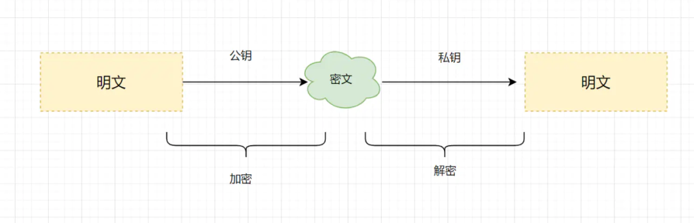

[TOC]

### 1.计算机网络体系结构

有三层：ISO七层模型、TCP/IP四层模型、五层体系结构。大家可以记住这个图，如下


#### 1.ISO七层模型

ISO七层模型是国际标准化组织（International Organization for Standardization）制定的一个用于计算机或通信系统间互联的标准体系。

> - **物理层（Physical Layer）**：
>   - 提供物理介质传输数据的方式和规范。
>   - 负责将比特流转换为电信号，并控制数据的传输速率、电压等参数。
> - **数据链路层（Data Link Layer）**：
>   - 负责将数据分割为帧（Frame）并在相邻节点之间传输。
>   - 提供可靠的点对点通信，进行错误检测和纠正，以及数据的传输控制。
> - **网络层（Network Layer）**：
>   - 管理节点之间的数据包传输，并负责寻址、路由和分组转发。
>   - 实现网络地址分配和选择最佳路径进行数据传输。
> - **传输层（Transport Layer）**：
>   - 提供端到端的可靠数据传输和流量控制。
>   - 通过协议如TCP和UDP，为应用层提供数据分段、传输控制和错误恢复等功能。
> - **会话层（Session Layer）**：
>   - 建立、管理和终止会话或连接。
>   - 负责对数据流进行同步、会话管理和安全性控制。
> - **表示层（Presentation Layer）**：
>   - 处理数据的表示和编码，确保不同系统间的数据格式兼容。
>   - 提供数据格式转换、加密解密和数据压缩等功能。
> - **应用层（Application Layer）**：
>   - 提供用户和应用程序之间的接口，支持特定的网络服务和应用。
>   - 包括常见的协议和服务，如HTTP、SMTP、FTP等。

#### 4.2 TCP/IP 四层模型

> - 应用层：对应于OSI参考模型的（应用层、表示层、会话层）。
> - 传输层: 对应OSI的传输层，为应用层实体提供端到端的通信功能，保证了数据包的顺序传送及数据的完整性。
> - 网际层：对应于OSI参考模型的网络层，主要解决主机到主机的通信问题。
> - 网络接口层：与OSI参考模型的数据链路层、物理层对应。
>
> ”

#### 4.3 五层体系结构

> - 应用层：对应于OSI参考模型的（应用层、表示层、会话层）。
> - 传输层：对应OSI参考模型的的传输层
> - 网络层：对应OSI参考模型的的网络层
> - 数据链路层：对应OSI参考模型的的数据链路层
> - 物理层：对应OSI参考模型的的物理层。

#### 4.4常见协议

> 下面是七层网络模型中各层次的一些常见网络协议示例：
>
> 1. **物理层（Physical Layer）**：
>
>    Ethernet, Wi-Fi, Bluetooth, RS-232, USB
>
> 2. **数据链路层（Data Link Layer）**：
>
>    Ethernet（IEEE 802.3）, Wi-Fi（IEEE 802.11）,PPP (Point-to-Point Protocol), HDLC (High-Level Data Link Control)
>
>    ATM (Asynchronous Transfer Mode)
>
> 3. **网络层（Network Layer）**：
>
>    IP (Internet Protocol), ICMP (Internet Control Message Protocol), ARP (Address Resolution Protocol)
>
>    OSPF (Open Shortest Path First), BGP (Border Gateway Protocol)
>
> 4. **传输层（Transport Layer）**：
>
>    TCP (Transmission Control Protocol), UDP (User Datagram Protocol)
>
>    SCTP (Stream Control Transmission Protocol), RTP (Real-time Transport Protocol)
>
>    DCCP (Datagram Congestion Control Protocol)
>
> 5. **会话层（Session Layer）**：
>
>    NetBIOS (Network Basic Input/Output System), SSL/TLS (Secure Sockets Layer/Transport Layer Security)
>
>    NFS (Network File System), PPTP (Point-to-Point Tunneling Protocol), SSH (Secure Shell)
>
> 6. **表示层（Presentation Layer）**：
>
>    ASCII (American Standard Code for Information Interchange)
>
>    JPEG (Joint Photographic Experts Group)
>
>    MPEG (Moving Picture Experts Group)
>
>    XML (eXtensible Markup Language), JSON (JavaScript Object Notation)
>
> 7. **应用层（Application Layer）**：
>
>    HTTP (Hypertext Transfer Protocol), FTP (File Transfer Protocol)
>
>    DNS (Domain Name System)
>
>    SMTP (Simple Mail Transfer Protocol)
>
>    POP3 (Post Office Protocol version 3)

### 2.常用端口及对应的服务


### 3.网络安全相关

#### 1.数字签名与数字证书

数字证书是指在互联网通讯中标志通讯各方身份信息的一个数字认证，人们可以在网上用它来识别对方的身份。它的出现，是为了避免身份被篡改冒充的。比如Https的数字证书，就是为了避免公钥被中间人冒充篡改：

**数字证书构成**

- 公钥和个人等信息，经过Hash摘要算法加密，形成消息摘要；将消息摘要拿到拥有公信力的认证中心（CA），用它的私钥对消息摘要加密，形成**数字签名**。
- 公钥和个人信息、数字签名共同构成**数字证书**。

#### 2.对称加密与非对称加密有什么区别

**思路:** 这道题考察的知识点是对称加密与非对称加密算法，什么是对称加密，什么是非对称加密呢？

**对称加密：**

> 指加密和解密使用同一密钥，优点是运算速度较快，缺点是如何安全将密钥传输给另一方。常见的对称加密算法有：DES、AES等。
>
> 

**非对称加密：**

> 指的是加密和解密使用不同的密钥（即公钥和私钥）。公钥与私钥是成对存在的，如果用公钥对数据进行加密，只有对应的私钥才能解密。常见的非对称加密算法有RSA。
>
> 

#### 3.什么是CSRF攻击，如何避免

> CSRF（Cross-Site Request Forgery）攻击是一种恶意攻击方式，攻击者通过利用用户的身份和权限，在用户不知情的情况下发送伪造的请求，以执行非法操作或获取敏感信息。以下是一些常见的防御CSRF攻击的方法：
>
> 1. **使用CSRF令牌（Token）**：在每个用户请求中包含一个CSRF令牌，该令牌由服务器生成并与用户会话相关联。攻击者无法获取有效的CSRF令牌，因此无法发送伪造的请求。服务器在接收到请求时验证令牌的有效性，如果令牌不匹配，则拒绝请求。
> 2. **检查Referer头**：服务器可以验证请求头中的Referer字段，确保请求来源于合法的域名。这样可以防止攻击者通过其他网站引导用户发送伪造的请求。
> 3. **使用SameSite Cookie属性**：设置Cookie的SameSite属性为Strict或Lax，限制Cookie只能在同一站点发起请求，防止跨站点请求。
> 4. **添加验证码**：对于执行敏感操作的请求，可以要求用户输入验证码进行验证，以确保请求的合法性。
> 5. **限制敏感操作的HTTP方法**：对于执行敏感操作的请求，只接受POST或其他安全的HTTP方法，并在服务器端进行验证。
> 6. **定期更改会话标识符（Session ID）**：定期更新会话标识符可以降低攻击者通过劫持会话进行CSRF攻击的风险。
> 7. **避免使用自动登录**：自动登录功能可能增加CSRF攻击的风险，因此尽量避免在敏感操作中使用自动登录。
>
> 这些防御措施并不是绝对的，攻击者可能采用更高级的手段进行CSRF攻击。因此，在开发和设计过程中，应综合考虑多种防御策略，并进行全面的安全测试和审计，确保系统对CSRF攻击具有足够的抵抗能力。

#### 4.什么是DoS、DDoS、DRDoS攻击, 如何避免

> DoS（Denial of Service）攻击、DDoS（Distributed Denial of Service）攻击和DRDoS（Distributed Reflection Denial of Service）攻击都是网络攻击形式，旨在通过消耗目标系统的资源或使其无法提供正常服务。
>
> 1. **DoS攻击**：DoS攻击是指攻击者通过向目标系统发送大量请求或占用系统资源，使系统无法正常响应合法用户的请求。常见的DoS攻击方式包括发送大量无效的请求、占用系统资源（如CPU或内存）的恶意程序等。为了防止DoS攻击，可以实施以下措施：
>    - 配置防火墙或入侵检测系统来监控和过滤恶意流量。
>    - 加强系统的资源管理和限制，限制每个请求的资源消耗。
>    - 使用负载均衡和流量分流技术，分散流量压力。
> 2. **DDoS攻击**：DDoS攻击是一种分布式的DoS攻击形式，攻击者通过控制多个"僵尸"计算机（也称为"肉鸡"或"僵尸网络"），同时向目标系统发送大量请求，造成系统资源的耗尽。常见的DDoS攻击类型包括SYN Flood、UDP Flood、HTTP Flood等。为了防止DDoS攻击，可以采取以下措施：
>    - 使用DDoS防护服务或设备，可以对流量进行过滤和清洗，阻止恶意流量进入目标系统。
>    - 配置负载均衡和流量分布策略，将流量均匀分散到多个服务器上。
>    - 支持云服务提供商的DDoS防护功能，利用其分布式架构和弹性扩展能力。
> 3. **DRDoS攻击**：DRDoS攻击（Distributed Reflection Denial of Service）是一种利用网络上的开放式服务作为反射器和放大器来发起DDoS攻击的方式。攻击者将目标地址伪装成攻击目标的IP地址，并向网络上的开放式服务发送请求。服务会将响应发送给目标地址（即攻击目标），从而将流量放大并淹没目标系统。为了避免DRDoS攻击，可以采取以下措施：
>    - 关闭或限制网络上的不必要的开放式服务，避免其被攻击者利用。
>    - 配置防火墙或反射过滤器，限制外部网络对内部网络的反射请求。
>    - 持续监控和分析网络流量，及时检测和应对异常流量。
>
> 除了上述措施，还可以采取其他防御策略，如增加带宽容量、使用入侵检测和入侵防御系统、配置网络安全设备等。网络安全是一个持续的过程，需要综合考虑多种防御措施来应对不断变化的攻击手段。

#### 5.什么是xss攻击, 如何避免

> XSS（Cross-Site Scripting）攻击是一种常见的网络安全漏洞，攻击者通过注入恶意脚本代码到受信任的网页中，使得用户在浏览器端执行该恶意脚本，从而达到攻击的目的。XSS攻击可以分为三种类型：
>
> 1. **存储型XSS**：攻击者将恶意脚本代码存储在目标网站的服务器上，当其他用户访问包含该恶意代码的页面时，恶意代码会被执行。
> 2. **反射型XSS**：攻击者将恶意脚本代码作为参数注入到URL中，当用户点击包含恶意代码的恶意链接时，恶意代码会被执行。
> 3. **DOM型XSS**：攻击者利用浏览器端解析HTML文档并生成DOM结构的过程中的漏洞，通过修改DOM元素或属性来执行恶意脚本。
>
> 为了避免XSS攻击，可以采取以下措施：
>
> 1. **输入验证和过滤**：对于用户输入的数据，进行验证和过滤，确保只接受预期的数据格式。例如，对于表单输入，可以使用输入验证库或自定义规则来限制输入的内容。
> 2. **输出编码**：在将用户输入的数据展示在网页上时，使用适当的编码方式进行转义，确保恶意脚本不会被执行。常用的编码方式包括HTML实体编码、URL编码等。
> 3. **设置HTTP头的Content Security Policy（CSP）**：CSP是一种安全策略，通过指定允许加载的资源类型和来源，限制浏览器执行外部脚本的能力，从而防止XSS攻击。
> 4. **使用安全的开发框架和库**：选择使用经过安全审计和广泛使用的开发框架和库，这些工具通常提供了内置的安全机制和过滤功能，有助于减少XSS攻击的风险。
> 5. **保持软件更新**：及时更新软件和组件，包括操作系统、Web服务器、数据库等，以修复已知的安全漏洞。
> 6. **敏感数据的安全处理**：对于包含敏感信息的数据，例如用户密码和个人资料，应采用适当的加密和保护措施，确保数据不易被窃取。
> 7. **教育和培训**：对开发人员和用户进行安全意识教育和培训，提高他们对XSS攻击的认识，并掌握预防措施。
>
> 综合采取以上措施可以显著减少XSS攻击的风险，但仍然需要持续关注最新的安全漏洞和攻击手法，并及时采取相应的防御措施。

#### 6.SQL注入

##### 1.SQL注入是如何攻击的

举个常见的**业务场景**：在web表单搜索框输入员工名字，然后后台查询出对应名字的员工。


这种场景下，一般都是前端页面,把一个名字参数name传到后台，然后后台通过SQL把结果查询出来

```sql
name = "田螺"; //前端传过来的

SQL= "select * from staff where name=" + name;  //根据前端传过来的name参数，查询数据库员工表staff
```

因为SQL是直接拼接的，如果我们完全信任前端传的参数的话。假如前端传这么一个参数时`'' or '1'='1'`，SQL就变成酱紫的啦。

```sql
select * from staff where name='' or '1'='1';
```

这个SQL会把所有的员工信息全都查出来了，酱紫就请求用户已经越权啦。请求者可以获取所有员工的信息，信息已经暴露了啦。

##### 2.如何预防SQL注入问题

**1). 使用#{}而不是 ${}**

在MyBatis中,使用`#{}`而不是`${}`，可以很大程度防止sql注入。

- 因为`#{}`是一个参数占位符，对于字符串类型，会自动加上""，其他类型不加。由于Mybatis采用**预编译**，其后的参数不会再进行SQL编译，所以一定程度上防止SQL注入。
- `${}`是一个简单的字符串替换，字符串是什么，就会解析成什么，存在SQL注入风险

**2). 不要暴露一些不必要的日志或者安全信息，比如避免直接响应一些sql异常信息。**

如果SQL发生异常了，不要把这些信息暴露响应给用户，可以自定义异常进行响应

**3). 不相信任何外部输入参数，过滤参数中含有的一些数据库关键词关键词**

可以加个参数校验过滤的方法，过滤`union，or`等数据库关键词

**4). 适当的权限控制**

在你查询信息时，先校验下当前用户是否有这个权限。比如说，实现代码的时候，可以让用户多传一个企业Id什么的，或者获取当前用户的session信息等，在查询前，先校验一下当前用户是否是这个企业下的等等，是的话才有这个查询员工的权限。

### 4.HTTP与HTTPS协议

HTTP（Hypertext Transfer Protocol）是一种用于在网络上传输超文本数据的应用层协议。它是基于客户端-服务器模型的协议，客户端发起请求，服务器进行响应。HTTP通常基于TCP/IP协议栈进行通信。

HTTPS（Hypertext Transfer Protocol Secure）是一种安全的通信协议，用于在网络上进行加密传输和安全通信。它是在HTTP协议的基础上添加了安全性的扩展。

#### 1.HTTP请求的过程

> HTTP请求，一个非常非常基础的知识点，一定需要掌握的。其实觉得跟浏览器地址栏输入url到显示主页这道题有点类似。
>
> **我的答案如下**：
>
> HTTP是一个基于TCP/IP协议来传递数据的超文本传输协议，传输的数据类型有HTML,图片等。以访问百度有例子，看下一次Http的请求过程吧
>
> Http请求过程
>
> 1. 客户端进行DNS域名解析，得到对应的IP地址
> 2. 根据这个IP，找到对应的服务器建立连接（三次握手）
> 3. 建立TCP连接后发起HTTP请求（一个完整的http请求报文）
> 4. 服务器响应HTTP请求，客户端得到html代码
> 5. 客户端解析html代码，用html代码中的资源(如js,css,图片等等)渲染页面。
> 6. 服务器关闭TCP连接（四次挥手）

#### 2.HTTPS是什么

> HTTPS（Hypertext Transfer Protocol Secure）是一种安全的通信协议，用于在网络上进行加密传输和安全通信。它是在HTTP协议的基础上添加了安全性的扩展。
>
> HTTPS的主要特点是使用SSL（Secure Sockets Layer）或TLS（Transport Layer Security）协议来加密通信内容，确保数据在传输过程中的机密性和完整性。通过使用公钥加密和私钥解密的方式，HTTPS可以在客户端和服务器之间建立一个安全的通道，防止中间人对数据进行窃听、篡改或劫持。
>
> HTTPS的工作原理如下：
>
> 1. **握手阶段**：客户端向服务器发送连接请求，并请求建立安全通信。服务器会返回自己的数字证书，其中包含公钥和其他证书信息。
> 2. **证书验证**：客户端会验证服务器证书的有效性。这包括检查证书的签名、有效期、颁发机构等信息，以确保服务器的身份和证书的合法性。
> 3. **密钥交换**：如果服务器的证书验证通过，客户端会生成一个随机的对称密钥，并使用服务器的公钥进行加密，然后将密文发送给服务器。服务器使用自己的私钥解密得到对称密钥。
> 4. **安全通信**：客户端和服务器都拥有了相同的对称密钥，之后的通信将使用对称密钥进行加密和解密，保证数据的安全传输。
>
> 通过使用HTTPS，可以实现以下安全性目标：
>
> - **数据机密性**：传输的数据经过加密，只有具有解密密钥的接收方才能解密和查看数据。
> - **数据完整性**：通过数字签名和校验和等机制，可以确保数据在传输过程中没有被篡改或损坏。
> - **身份验证**：通过数字证书的验证，可以确保通信的对方是预期的服务器，防止中间人攻击。
> - **抵御中间人窃听**：通过加密通信内容，可以防止中间人窃听传输的数据。
>
> HTTPS广泛应用于需要保护用户隐私和防止数据篡改的场景，例如网上银行、电子商务、登录认证等。它提供了更高的安全性和数据保护，使得用户在网络上的通信更加安全可靠。

#### 3.HTTPS工作流程

> 1. 客户端发起Https请求，连接到服务器的443端口。
> 2. 服务器必须要有一套数字证书（证书内容有公钥、证书颁发机构、失效日期等）。
> 3. 服务器将自己的数字证书发送给客户端（公钥在证书里面，私钥由服务器持有）。
> 4. 客户端收到数字证书之后，会验证证书的合法性。如果证书验证通过，就会生成一个随机的对称密钥，用证书的公钥加密。
> 5. 客户端将公钥加密后的密钥发送到服务器。
> 6. 服务器接收到客户端发来的密文密钥之后，用自己之前保留的私钥对其进行非对称解密，解密之后就得到客户端的密钥，然后用客户端密钥对返回数据进行对称加密，酱紫传输的数据都是密文啦。
> 7. 服务器将加密后的密文返回到客户端。
> 8. 客户端收到后，用自己的密钥对其进行对称解密，得到服务器返回的数据。

#### 4.HTTP和HTTPS区别

> HTTP（Hypertext Transfer Protocol）和HTTPS（Hypertext Transfer Protocol Secure）是用于在客户端和服务器之间传输数据的协议，它们有以下区别：
>
> 1. **安全性**：HTTP是明文传输协议，数据在传输过程中不进行加密，容易被中间人窃听、篡改或劫持。而HTTPS使用SSL/TLS协议进行加密通信，能够确保传输的数据的机密性和完整性，提供更高的安全性。
> 2. **默认端口**：HTTP使用的默认端口是80，而HTTPS使用的默认端口是443。通过指定不同的端口，可以区分使用HTTP还是HTTPS进行通信。
> 3. **证书验证**：HTTPS在建立连接时需要服务器端提供数字证书，用于验证服务器的身份。客户端会检查证书的有效性，确保与服务器的通信是安全的。而HTTP没有这种证书验证机制，无法确认服务器的真实性。
> 4. **协议实现**：HTTP使用TCP协议进行数据传输，而HTTPS在HTTP的基础上添加了SSL/TLS协议来加密通信内容。
> 5. **性能**：HTTPS因为需要进行加密和解密操作，相比于HTTP会增加一些额外的计算和传输开销，可能导致略微的性能损失。但随着计算能力的提升和网络的进步，这种差距已经减小到可以忽略不计的程度。
>
> 总结来说，HTTPS相比于HTTP提供了更高的安全性，适用于对数据保密性和完整性有更高要求的场景，例如网上银行、电子商务等需要保护用户隐私和防止数据被篡改的应用。而HTTP适用于不涉及敏感信息传输的场景，例如一般的网页浏览。

#### 5.若建立连接时间比较长，HTTP是怎么优化的

> 如果HTTP的建立连接时间比较长，可以采取以下优化策略来改善性能：
>
> 1. **持久连接（Keep-Alive）**：HTTP/1.1引入了持久连接机制，即在单个TCP连接上可以发送多个HTTP请求和响应，而无需每次都建立和关闭连接。这样可以减少建立连接的开销，提高性能。
> 2. **连接池（Connection Pooling）**：为了避免频繁地建立和关闭TCP连接，可以使用连接池来管理连接。连接池会维护一组已建立的TCP连接，以供多个HTTP请求复用。这样可以减少连接建立的时间和资源消耗。
> 3. **并行连接（Parallel Connections）**：在浏览器端，可以通过并行连接的方式发送多个HTTP请求，以提高页面加载速度。通过同时使用多个TCP连接，可以并行地请求不同的资源，减少等待时间。
> 4. **DNS预解析（DNS Prefetching）**：在浏览器端，可以使用DNS预解析来提前解析域名对应的IP地址。这样在发送HTTP请求时，可以直接使用解析结果，避免DNS解析的延迟。
> 5. **使用CDN（Content Delivery Network）**：使用CDN可以将静态资源部署在离用户较近的服务器上，减少网络延迟和提高响应速度。CDN可以缓存和分发静态内容，减轻源服务器的负载，提高性能。
> 6. **使用缓存（Caching）**：合理使用HTTP缓存可以避免重复的网络请求，提高响应速度。通过设置适当的缓存策略和响应头，浏览器可以缓存静态资源，并在后续请求时直接从缓存中获取数据。
> 7. **压缩数据（Compression）**：在传输过程中，可以使用压缩算法对HTTP请求和响应的数据进行压缩。减少传输的数据量可以减少网络延迟和带宽消耗，提高性能。
>
> 这些优化策略可以减少建立连接的时间和提高HTTP请求的效率，从而改善性能和用户体验。具体的优化策略可以根据具体的应用场景和需求来选择和实施。

#### 6.HTTP 如何实现长连接？在什么时候会超时？

**思路:** 这道题实际上是考察TCP长连接的知识点，HTTP的长连接实质是指TCP的长连接。至于什么时候超时，我们记住这几个参数如**tcp_keepalive_time**、**tcp_keepalive_probes**就好啦

**什么是HTTP的长连接？**

- 1. HTTP分为长连接和短连接，**本质上说的是TCP的长短连接**。TCP连接是一个双向的通道，它是可以保持一段时间不关闭的，因此TCP连接才具有真正的长连接和短连接这一说法哈。

     

  2. TCP长连接可以复用一个TCP连接，来发起多次的HTTP请求，这样就可以减少资源消耗，比如一次请求HTML，如果是短连接的话，可能还需要请求后续的JS/CSS。

**如何设置长连接？**

通过在头部（请求和响应头）设置**Connection**字段指定为`keep-alive`，HTTP/1.0协议支持，但是是默认关闭的，从HTTP/1.1以后，连接默认都是长连接。

**在什么时候会超时呢？**

> - HTTP一般会有httpd守护进程，里面可以设置**keep-alive timeout**，当tcp连接闲置超过这个时间就会关闭，也可以在HTTP的header里面设置超时时间
> - TCP 的**keep-alive**包含三个参数，支持在系统内核的net.ipv4里面设置；当 TCP 连接之后，闲置了**tcp_keepalive_time**，则会发生侦测包，如果没有收到对方的ACK，那么会每隔 tcp_keepalive_intvl再发一次，直到发送了**tcp_keepalive_probes**，就会丢弃该连接。

```shell
1. tcp_keepalive_intvl = 15
2. tcp_keepalive_probes = 5
3. tcp_keepalive_time = 1800
```

#### 7.在交互过程中如果数据传送完了，还不想断开连接怎么办，怎么维持？

在HTTP中响应体的**Connection**字段指定为`keep-alive`即可

#### 8.HTTP/1.0，1.1，2.0的区别

**思路:** 这道题主要考察的知识点是HTTP几个版本的区别，我们记住**HTTP/1.0**默认是短连接，可以强制开启，HTTP/1.1默认长连接，HTTP/2.0采用**多路复用**就差不多啦。

> **HTTP/1.0**
>
> - 默认使用**短连接**，每次请求都需要建立一个TCP连接。它可以设置`Connection: keep-alive` 这个字段，强制开启长连接。
>
> **HTTP/1.1**
>
> - 引入了持久连接，即TCP连接默认不关闭，可以被多个请求复用。
> - 分块传输编码，即服务端没产生一块数据，就发送一块，用”流模式”取代”缓存模式”。
> - 管道机制，即在同一个TCP连接里面，客户端可以同时发送多个请求。
>
> **HTTP/2.0**
>
> - 二进制协议，1.1版本的头信息是文本（ASCII编码），数据体可以是文本或者二进制；2.0中，头信息和数据体都是二进制。
> - 完全多路复用，在一个连接里，客户端和浏览器都可以同时发送多个请求或回应，而且不用按照顺序一一对应。
> - 报头压缩，HTTP协议不带有状态，每次请求都必须附上所有信息。Http/2.0引入了头信息压缩机制，使用gzip或compress压缩后再发送。
> - 服务端推送，允许服务器未经请求，主动向客户端发送资源。

> HTTP/1.0和HTTP/2.0是HTTP协议的不同版本，它们在以下几个方面有显著的区别：
>
> 1. **连接复用（Connection Multiplexing）**：
>    - HTTP/1.0使用每个请求一个连接的方式，在每次请求时都需要建立一个新的TCP连接，增加了延迟和资源消耗。
>    - HTTP/2.0支持多路复用，可以在单个TCP连接上同时发送多个请求和接收多个响应，减少了连接建立的开销，提高了性能。
> 2. **头部压缩（Header Compression）**：
>    - HTTP/1.0的请求和响应头部信息都是明文传输的，每次请求都需要携带相同的头部信息，导致冗余传输。
>    - HTTP/2.0使用HPACK算法对头部信息进行压缩，减少了数据传输量，提高了效率。
> 3. **二进制传输（Binary Framing）**：
>    - HTTP/1.0的数据传输是基于文本的，使用可读的ASCII字符，容易解析但效率较低。
>    - HTTP/2.0使用二进制传输，将请求和响应消息分割为二进制帧，提高了传输效率和解析速度。
> 4. **服务器推送（Server Push）**：
>    - HTTP/1.0需要客户端主动发送请求才能获取资源，服务器无法主动推送相关资源。
>    - HTTP/2.0引入了服务器推送功能，服务器可以在响应一个请求时主动推送相关资源，减少了客户端的额外请求。
> 5. **流量控制（Flow Control）**：
>    - HTTP/1.0没有内置的流量控制机制，当服务器的响应过快时，客户端可能无法处理所有的响应。
>    - HTTP/2.0支持流量控制机制，可以根据客户端的处理能力动态调整数据传输的速率，避免了过载情况的发生。
>
> 综上所述，HTTP/2.0相较于HTTP/1.0具有更高的性能和效率，主要得益于连接复用、头部压缩、二进制传输、服务器推送和流量控制等新特性的引入。这些改进使得HTTP/2.0更适合处理现代网页和应用中大量并行请求和资源的场景，并提供了更好的用户体验。

#### 9.如何理解HTTP协议是无状态的

**思路:** 这道题主要考察候选人，是否理解Http协议，它为什么是无状态的呢？如何使它有状态呢？

如何理解无状态这个词呢？

> 当浏览器第一次发送请求给服务器时，服务器响应了；如果同个浏览器发起第二次请求给服务器时，它还是会响应，但是呢，服务器不知道你就是刚才的那个浏览器。简言之，服务器不会去记住你是谁，所以是无状态协议。

#### 10.从浏览器地址栏输入url到显示主页的过程

**思路:** 这道题主要考察的知识点是HTTP的请求过程，**DNS解析，TCP三次握手，四次挥手这几个要点**，我们都可以讲下。

> 1. DNS解析，查找域名对应的IP地址。
> 2. 与服务器通过三次握手，建立TCP连接
> 3. 向服务器发送HTTP请求
> 4. 服务器处理请求，返回网页内容
> 5. 浏览器解析并渲染页面
> 6. TCP四次挥手，连接结束


#### 11.HTTP 常用的请求方式，区别和用途


##### 1.GET和POST的区别

> 

#### 12.HTTP常用的状态码及其含义

> HTTP状态码分为不同的类别，从100系列到500系列，每个系列表示一类特定的状态。下面是对各个系列的详细解释：
>
> **100系列（Informational）**：这是一个信息性的状态码系列，表示请求已被接受或正在处理。
>
> - **100 Continue**：服务器已接收到请求的初始部分，客户端应继续发送剩余的请求。
> - **101 Switching Protocols**：服务器已根据客户端的请求切换协议。
>
> **200系列（Successful）**：这是一个成功的状态码系列，表示请求已成功处理并返回了结果。
>
> - **200 OK**：请求成功，服务器成功处理了请求。
> - **201 Created**：请求成功，并且服务器创建了新的资源。
> - **204 No Content**：请求成功，但服务器没有返回任何内容。
>
> **300系列（Redirection）**：这是一个重定向的状态码系列，表示客户端需要采取进一步的操作才能完成请求。
>
> - **301 Moved Permanently**：请求的资源已永久移动到新的URL，客户端应更新其链接。
> - **302 Found**：请求的资源暂时移动到了新的URL，客户端应继续使用原始URL。
> - **304 Not Modified**：客户端发出了条件性请求，但资源未被修改，可以使用缓存的版本。
>
> **400系列（Client Error）**：这是一个客户端错误的状态码系列，表示请求包含错误或无法被服务器理解。
>
> - **400 Bad Request**：请求无效，服务器无法理解或处理请求。
> - **401 Unauthorized**：请求未经授权，需要身份验证。
> - **403 Forbidden**：服务器拒绝请求，客户端没有访问权限。
> - **404 Not Found**：请求的资源不存在。
>
> **500系列（Server Error）**：这是一个服务器错误的状态码系列，表示服务器在处理请求时发生了错误。
>
> - **500 Internal Server Error**：服务器内部错误，无法完成请求。
> - **503 Service Unavailable**：服务器当前无法处理请求，通常是由于过载或维护。
>
> 这些状态码覆盖了常见的请求和处理情况，帮助客户端和服务器之间进行有效的通信和错误处理。通过正确解析和处理这些状态码，可以根据情况采取适当的操作或显示适当的消息，以提供更好的用户体验。

##### 1.301和302的区别

> - 301：（永久性转移）请求的网页已被永久移动到新位置。服务器返回此响应时，会自动将请求者转到新位置。
> - 302：（暂时性转移）服务器目前正从不同位置的网页响应请求，但请求者应继续使用原有位置来进行以后的请求。此代码与响应GET和HEAD请求的301代码类似，会自动将请求者转到不同的位置。

### 5.DNS协议

DNS（Domain Name System）是一种用于将域名解析为对应 IP 地址的分布式命名系统。它充当了互联网上域名和 IP 地址之间的转换器。DNS 使用层次化的命名结构，并提供了域名解析、域名查询和域名缓存等功能。

#### 1.解析过程

> - 首先会查找浏览器的缓存,看看是否能找到**www.baidu.com**对应的IP地址，找到就直接返回；否则进行下一步。
> - 将请求发往给本地DNS服务器，如果查找到也直接返回，否则继续进行下一步；
> - 本地DNS服务器向**根域名服务器**发送请求，根域名服务器返回负责`.com`的顶级域名服务器的IP地址的列表。
> - 本地DNS服务器再向其中一个负责`.com`的顶级域名服务器发送一个请求，返回负责`.baidu`的权威域名服务器的IP地址列表。
> - 本地DNS服务器再向其中一个权威域名服务器发送一个请求，返回**www.baidu.com**所对应的IP地址。


### 6.IP协议

IP（Internet Protocol）协议是在网络层（第三层）操作的一种协议，负责将数据包从源主机传输到目标主机。

#### 1.工作流程

> 1. **数据封装**：当源主机要发送数据时，数据被分割成小的数据包（也称为IP数据报）。每个数据包包含源IP地址和目标IP地址以及其他必要的信息。
> 2. **路由选择**：源主机将数据包发送到本地网络中的默认网关（通常是路由器）。路由器根据目标IP地址和路由表中的信息，确定下一个跳的路由器，将数据包转发到下一个跳。
> 3. **跨网络传输**：数据包在网络中通过一系列的路由器进行跳转，每个路由器根据目标IP地址和路由表中的信息选择下一个跳。这个过程持续进行，直到数据包到达目标主机所在的网络。
> 4. **数据包到达目标主机**：当数据包到达目标主机所在的网络后，目标主机的网络协议栈接收到数据包，并进行解析。
> 5. **数据包重组**：如果数据包在传输过程中被分割成多个片段，目标主机的网络协议栈会将这些片段按照顺序进行重组，还原成完整的数据包。
> 6. **数据包交付**：目标主机根据目标IP地址判断数据包是否是发往自己的，并将数据包传递给上层协议（如TCP或UDP）进行进一步的处理。
> 7. **数据包处理**：上层协议根据端口号等信息将数据包交给相应的应用程序进行处理。
>
> 总结起来，IP协议的工作流程涉及数据封装、路由选择、跨网络传输、数据包到达目标主机、数据包重组和数据包交付等步骤，确保数据能够在网络中正确地传输到目标主机。

#### 2.分类

> 一般可以这么认为，IP地址=网络号+主机号。
>
> 1. 网络号：它标志主机所连接的网络地址表示属于互联网的哪一个网络。
> 2. 主机号：它标志主机地址表示其属于该网络中的哪一台主机。
>
> IP地址分为A，B，C，D，E五大类：
>
> - A类地址(1~126)：以0开头，网络号占前8位，主机号占后面24位。
> - B类地址(128~191)：以10开头，网络号占前16位，主机号占后面16位。
> - C类地址(192~223)：以110开头，网络号占前24位，主机号占后面8位。
> - D类地址(224~239)：以1110开头，保留位多播地址。
> - E类地址(240~255)：以11110开头，保留位为将来使用

### 7.ARP协议

ARP 协议协议，**Address Resolution Protocol**，地址解析协议，它是用于实现IP地址到MAC地址的映射。

#### 1.工作流程

> 1. 首先，每台主机都会在自己的ARP缓冲区中建立一个ARP列表，以表示IP地址和MAC地址的对应关系。
> 2. 当源主机需要将一个数据包要发送到目的主机时，会首先检查自己的ARP列表，是否存在该IP地址对应的MAC地址；如果有﹐就直接将数据包发送到这个MAC地址；如果没有，就向本地网段发起一个ARP请求的广播包，查询此目的主机对应的MAC地址。此ARP请求的数据包里，包括源主机的IP地址、硬件地址、以及目的主机的IP地址。
> 3. 网络中所有的主机收到这个ARP请求后，会检查数据包中的目的IP是否和自己的IP地址一致。如果不相同，就会忽略此数据包；如果相同，该主机首先将发送端的MAC地址和IP地址添加到自己的ARP列表中，如果ARP表中已经存在该IP的信息，则将其覆盖，然后给源主机发送一个 ARP响应数据包，告诉对方自己是它需要查找的MAC地址。
> 4. 源主机收到这个ARP响应数据包后，将得到的目的主机的IP地址和MAC地址添加到自己的ARP列表中，并利用此信息开始数据的传输。如果源主机一直没有收到ARP响应数据包，表示ARP查询失败。

#### 2.有了IP地址, 为什么还需要MAC地址

> - 简而言之，标识网络中的一台计算机，比较常用的就是**IP地址和MAC地址**，但计算机的IP地址可由用户自行更改，管理起来就相对困难，而MAC地址不可更改，所以一般会把IP地址和MAC地址组合起来使用。
> - 那只使用MAC地址不用IP地址行不行呢？不行的！因为最早就是MAC地址先出现的，并且当时并不用IP地址，只用MAC地址，后来随着网络中的设备越来越多，整个路由过程越来越复杂，便出现了子网的概念。对于目的地址在其他子网的数据包，路由只需要将数据包送到那个子网即可。
> - 那为什么要用IP地址呢？是因为IP地址是和地域相关的，对于同一个子网上的设备，IP地址的前缀都是一样的，这样路由器通过IP地址的前缀就知道设备在在哪个子网上了，而只用MAC地址的话，路由器则需要记住每个MAC地址在哪个子网，这需要路由器有极大的存储空间，是无法实现的。
> - IP地址可以比作为地址，MAC地址为收件人，在一次通信过程中，两者是缺一不可的。

### 8.TCP和UDP协议

TCP（Transmission Control Protocol）是一种面向连接的、可靠的传输协议，它在网络通信中扮演重要角色。

UDP（User Datagram Protocol）是一种无连接的传输层协议，它提供了面向事务的简单数据传输服务。相对于TCP协议，UDP协议不提供可靠性、流量控制和拥塞控制等机制，但由于其简单性和低延迟的特点，适用于一些对实时性要求较高的应用场景。

#### 1.TCP的工作流程和核心机制

> 1. **建立连接**：通信的两端需要先进行三次握手来建立连接。客户端发送一个SYN（同步）报文给服务器端，服务器端收到后回复一个SYN-ACK（同步-确认）报文给客户端，最后客户端再回复一个ACK（确认）报文给服务器端。这样双方就建立了连接，并进入连接状态。
> 2. **数据传输**：建立连接后，双方可以通过TCP进行数据传输。数据被分割成多个TCP数据段，每个数据段包含一个序列号，用于确保数据的顺序和完整性。发送方将数据段发送给接收方，接收方收到后发送确认应答，以便发送方知道数据已经被接收。
> 3. **流量控制**：TCP使用滑动窗口机制来进行流量控制。发送方根据接收方的处理能力和网络状况，动态调整发送数据的速率。接收方通过发送窗口大小告知发送方自己的可接收数据量，以控制发送速率，确保接收方不会被过多的数据淹没。
> 4. **拥塞控制**：TCP还实现了拥塞控制机制，用于控制网络的拥塞程度。通过监测网络延迟和丢包情况，TCP动态调整发送速率，以避免网络拥塞的发生，从而提高整体的网络性能。
> 5. **可靠性保证**：TCP提供可靠的数据传输，通过序列号和确认应答机制来保证数据的完整性和顺序性。如果发送方没有收到确认应答，会进行超时重传，确保数据的可靠性。
> 6. **连接关闭**：当双方不再需要连接时，需要进行四次挥手来关闭连接。一方发送一个FIN报文段给对方，表示自己没有数据要发送了，请求关闭连接。接收方回复一个ACK报文段作为确认，然后发送自己的FIN报文段给发起方，表示自己也没有数据要发送了。最后，发起方发送一个ACK报文段作为确认，双方都进入关闭状态。
>
> 总结起来，TCP通过建立连接、数据传输、流量控制、拥塞控制、可靠性保证和连接关闭等机制，实现了可靠的数据传输。它适用于对数据完整性和顺序性要求较高的应用，如文件传输、电子邮件、Web浏览等。

##### 1.滑动窗口

> 滑动窗口机制的主要原理如下：
>
> 1. **发送窗口（Send Window）**：
>    - 发送方维护一个发送窗口，表示可发送的数据段的范围。发送窗口的大小由接收方的接收窗口大小和网络的拥塞情况决定。
> 2. **接收窗口（Receive Window）**：
>    - 接收方维护一个接收窗口，表示可以接收的数据段的范围。接收窗口的大小由接收方的可用缓冲区大小决定。
> 3. **滑动操作（Sliding Operation）**：
>    - 发送方发送数据段时，将发送窗口内的数据段连续发送给接收方，同时等待接收方发送确认（ACK）。
>    - 一旦接收到确认，发送方将滑动发送窗口，即将窗口向前滑动，更新窗口的起始位置和大小。
>    - 接收方收到数据段后，将其交付给上层应用程序，并发送确认给发送方，确认收到数据段。
> 4. **流量控制（Flow Control）**：
>    - 接收方通过发送窗口的大小来告知发送方自己可接收的数据量。如果接收窗口变小，发送方需要相应减小发送窗口的大小以避免发送过多数据。
>
> 滑动窗口机制的优点是可以实现流量控制和拥塞控制，使发送方和接收方能够根据自身的处理能力和网络状况进行协调。它提高了数据传输的效率和可靠性，并且适应了不同网络环境下的变化。

##### 2.快速重传

> TCP的快速重传机制是为了更快地检测和恢复丢失的数据段，以提高传输的效率和可靠性。当发送方连续收到三个重复的确认应答（ACK）时，就会触发快速重传。
>
> 下面是TCP快速重传机制的详细步骤：
>
> 1. 发送方发送数据段：发送方将数据分割成多个数据段，并使用序列号进行编号。发送方发送数据段给接收方，并启动计时器来等待接收方的确认应答。
> 2. 接收方收到数据段：接收方按顺序接收数据段，并发送确认应答给发送方。确认应答中包含期望接收的下一个数据段的序列号。
> 3. 发送方收到确认应答：发送方收到接收方发送的确认应答，检查确认应答中的序列号。
> 4. 重复确认应答的情况：如果发送方连续收到三个重复的确认应答，表示中间的某个数据段丢失。
> 5. 触发快速重传：发送方一旦检测到连续三个重复的确认应答，就会认为对应的数据段丢失，并立即进行快速重传。
> 6. 快速重传的数据段：发送方重新发送丢失的数据段，不等待计时器超时，以加快数据的传输速度。
> 7. 更新发送方的计时器：发送方在快速重传后，重新设置计时器，等待新的确认应答。
>
> 通过快速重传机制，TCP可以更快地检测到丢失的数据段，并进行重传，而不必等待计时器超时。这样可以减少传输的延迟，并提高数据的传输效率和可靠性。快速重传机制是TCP拥塞控制和可靠性保证的重要组成部分之一。

##### 3.拥塞控制

> TCP拥塞控制是一种算法和机制，用于控制网络中的拥塞情况，以避免网络过载和性能下降。TCP拥塞控制的目标是维持网络的稳定性和公平性，确保网络资源的合理分配，并提高整体的传输效率。
>
> TCP拥塞控制的主要机制包括以下几个方面：
>
> 1. **慢启动（Slow Start）**：在连接建立和拥塞恢复阶段，TCP发送方初始的发送窗口大小（即允许发送的数据量）较小。然后，每当收到一个确认应答，发送窗口的大小就会指数级增加，以快速适应当前的网络状况。
> 2. **拥塞避免（Congestion Avoidance）**：一旦发送窗口大小达到一个阈值（拥塞窗口大小），TCP进入拥塞避免阶段。在拥塞避免阶段，发送方以线性增加的方式增加拥塞窗口的大小，以缓慢增加发送速率，避免引发网络拥塞。
> 3. **快重传（Fast Retransmit）**：当发送方连续收到三个重复的确认应答（冗余ACK），表示某个数据段可能丢失。发送方不必等待重传定时器超时，而是立即重传丢失的数据段，以加快数据的传输速度。
> 4. **快恢复（Fast Recovery）**：在快重传的过程中，发送方进入快恢复状态，将拥塞窗口减半，并逐渐增加拥塞窗口的大小。这样可以更好地控制拥塞窗口的增长速率，避免过度拥塞和网络性能下降。
> 5. **超时重传（Timeout Retransmission）**：如果发送方在一定时间内没有收到确认应答，就会认为数据丢失，并触发超时重传机制。发送方会重新发送未确认的数据段，以确保数据的可靠性。
>
> 通过这些机制，TCP可以根据网络的拥塞程度和延迟情况来动态调整发送速率和拥塞窗口的大小，以避免网络拥塞的发生，并保证数据的可靠传输。拥塞控制是TCP可靠性传输和高性能的关键之一，使得TCP成为网络通信中最为广泛使用的传输协议之一。

##### 4.慢启动算法

慢启动算法，表面意思就是，别急慢慢来。它表示TCP建立连接完成后，一开始不要发送大量的数据，而是先探测一下网络的拥塞程度。由小到大逐渐增加拥塞窗口的大小，如果没有出现丢包，**每收到一个ACK，就将拥塞窗口cwnd大小就加1（单位是MSS）**。**每轮次**发送窗口增加一倍，呈指数增长，如果出现丢包，拥塞窗口就减半，进入拥塞避免阶段。

- TCP连接完成，初始化cwnd = 1，表明可以传一个MSS单位大小的数据。
- 每当收到一个ACK，cwnd就加一;
- 每当过了一个RTT，cwnd就增加一倍; 呈指数让升

#### 2.UDP协议的工作原理和流程

> UDP协议的工作流程和原理如下：
>
> 1. **无连接性**：UDP协议是无连接的，不需要在数据传输前建立连接。发送方可以直接将数据封装成UDP数据报并发送给接收方。
> 2. **数据报格式**：UDP协议使用数据报来进行数据传输。UDP数据报由数据和报头组成，报头包含源端口号和目标端口号等信息。
> 3. **不可靠性**：UDP协议不提供数据传输的可靠性保证。发送方将数据发送出去后，不会对数据是否到达目标进行确认，也不会重传丢失的数据。
> 4. **无拥塞控制**：UDP协议没有拥塞控制机制，即发送方不会根据网络的拥塞程度来调整发送速率。这意味着在网络拥塞的情况下，UDP的性能可能会受到影响。
> 5. **适用于实时应用**：由于UDP协议的简单性和低延迟特点，它适用于对实时性要求较高的应用场景，如音频和视频传输、实时游戏等。
>
> UDP协议的原理是将数据封装成UDP数据报，并通过网络传输到目标主机。接收方根据目标端口号来接收数据报，并将数据解析出来。由于UDP协议没有可靠性保证和拥塞控制，因此在使用UDP进行数据传输时，需要在应用层进行相应的错误处理和控制机制，以确保数据的完整性和可靠性。

#### 3.基于两种协议的应用层协议

> **基于TCP的应用层协议有：HTTP、FTP、SMTP、TELNET、SSH**
>
> - **HTTP**：HyperText Transfer Protocol（超文本传输协议），默认端口80
> - **FTP**: File Transfer Protocol (文件传输协议), 默认端口(20用于传输数据，21用于传输控制信息)
> - **SMTP**: Simple Mail Transfer Protocol (简单邮件传输协议) ,默认端口25
> - **TELNET**: Teletype over the Network (网络电传), 默认端口23
> - **SSH**：Secure Shell（安全外壳协议），默认端口 22
>
> **基于UDP的应用层协议：DNS、TFTP、SNMP**
>
> - **DNS** : Domain Name Service (域名服务),默认端口 53
> - **TFTP**: Trivial File Transfer Protocol (简单文件传输协议)，默认端口69
> - **SNMP**：Simple Network Management Protocol（简单网络管理协议），通过UDP端口161接收，只有Trap信息采用UDP端口162。

#### 3.TCP和UDP的区别

> TCP（Transmission Control Protocol）和UDP（User Datagram Protocol）是两种常用的传输层协议，它们有以下区别：
>
> 1. **连接导向 vs 无连接**：TCP是一种面向连接的协议，它在通信双方建立连接后进行可靠的数据传输，保证数据的完整性和顺序性。UDP是一种无连接的协议，数据包之间相互独立，没有建立连接的过程，也不保证数据的可靠性和顺序性。
> 2. **数据传输特性**：TCP提供可靠的数据传输，通过使用确认、重传和拥塞控制等机制，确保数据的完整性和可靠性。UDP提供的是不可靠的数据传输，数据包发送后不进行确认和重传，因此可能会有丢包和乱序的情况。
> 3. **传输效率**：由于TCP提供的是可靠的传输服务，它的传输效率相对较低。TCP的可靠性机制会增加额外的开销，包括建立连接的握手过程、确认机制和拥塞控制等，从而影响传输速度。而UDP没有这些机制，因此传输效率较高。
> 4. **应用场景**：由于TCP的可靠性和顺序性，它常用于需要确保数据完整性的应用，如文件传输、电子邮件、Web浏览等。而UDP适用于实时性要求较高的应用，如音视频流媒体、实时通信（如语音通话和视频会议）等，因为它更注重传输效率和实时性。
> 5. **首部开销**：TCP的首部开销较大，占用的字节数相对较多，包括序号、确认号、窗口大小、校验和等字段。而UDP的首部开销相对较小，只包含源端口号、目标端口号、长度和校验和等字段。
>
> 综上所述，TCP提供可靠的、面向连接的数据传输服务，适用于对数据完整性和顺序性要求较高的场景；UDP提供不可靠的、无连接的数据传输服务，适用于实时性要求较高的场景。选择使用哪种协议应根据具体的应用需求进行权衡和选择。

#### 4.三次握手和四次挥手

> 三次握手（Three-Way Handshake）
>
> 是指在建立TCP连接时，客户端和服务器之间进行的一系列确认和同步步骤，确保双方能够正确地建立连接。以下是三次握手的过程：
>
> 1. **第一次握手（SYN）：** 客户端发送一个带有 SYN（同步）标志的TCP报文段给服务器，请求建立连接。该报文段中包含一个随机生成的初始序列号（ISN）。
> 2. **第二次握手（SYN + ACK）：** 服务器接收到客户端的请求后，发送一个带有 SYN 和 ACK（确认）标志的TCP报文段给客户端，表示同意建立连接。该报文段中包含确认号（ACK）为客户端发送的初始序列号加一，同时也包含服务器生成的随机初始序列号。
> 3. **第三次握手（ACK）：** 客户端收到服务器的确认后，发送一个带有 ACK 标志的TCP报文段给服务器，确认连接建立。该报文段中的确认号为服务器的初始序列号加一。
>
> 通过这三次握手，客户端和服务器都确认了对方的能力和意愿，确保了连接的建立和同步。
>
> 
>
> 四次挥手（Four-Way Handshake）
>
> 是指在关闭TCP连接时，客户端和服务器之间进行的一系列确认和关闭步骤，确保双方能够正确地关闭连接。以下是四次挥手的过程：
>
> 1. **第一次挥手（FIN）：** 当客户端决定关闭连接时，发送一个带有 FIN（结束）标志的TCP报文段给服务器，表示客户端不再发送数据。
> 2. **第二次挥手（ACK）：** 服务器收到客户端的关闭请求后，发送一个带有 ACK 标志的TCP报文段给客户端，确认接收到了关闭请求。
> 3. **第三次挥手（FIN）：** 当服务器也准备关闭连接时，发送一个带有 FIN 标志的TCP报文段给客户端，表示服务器不再发送数据。
> 4. **第四次挥手（ACK）：** 客户端收到服务器的关闭请求后，发送一个带有 ACK 标志的TCP报文段给服务器，确认接收到了关闭请求。
>
> 通过这四次挥手，客户端和服务器都确认了对方的关闭请求，并完成了连接的关闭过程。这样可以确保双方都没有未完成的数据传输，避免数据丢失或占用资源。

#### 5.为什么是4次挥手, 而不是其他次数

> TCP的四次挥手是为了确保双方在关闭连接时的可靠性和完整性。下面解释为什么需要四次挥手：
>
> 1. **关闭发起方发送FIN**：关闭连接的一方（称为发起方）首先发送一个FIN（Finish）报文段给对方，表示自己没有数据要发送了，请求关闭连接。
> 2. **关闭接收方发送ACK**：接收到FIN的一方（称为接收方）收到FIN后，会发送一个ACK（Acknowledgment）报文段作为确认，表示已经收到发起方的关闭请求。
> 3. **接收方发送FIN**：接收方在发送完ACK后，可能还有数据要发送给发起方，所以它需要先发送一个FIN报文段给发起方，表示自己也没有数据要发送了，并请求关闭连接。
> 4. **关闭发起方发送ACK**：发起方收到接收方的FIN后，发送一个ACK报文段作为确认，表示已经收到接收方的关闭请求，并进入TIME_WAIT状态。此时，发起方需要等待一段时间（通常为两倍的最大报文段生命周期，即MSL）才能彻底关闭连接。这是为了确保最后一个ACK报文能够到达接收方，以防止它在网络中被丢失。
>
> 通过这四次挥手，双方可以完成连接的关闭，并确保双方都能收到对方的关闭请求和确认。这样可以防止数据丢失或错误的重传，确保连接的可靠性和完整性。如果使用更少的挥手次数，可能会导致双方无法正常关闭连接，或者出现数据丢失的情况。因此，四次挥手是为了保证连接关闭的可靠性而设计的。

#### 6.时间等待计时器和保活计时器的作用

> 在TCP协议中，时间等待计时器（Time-Wait Timer）是用于处理TCP连接的关闭过程的一种机制。当TCP连接中的一方（通常是主动关闭连接的一方）发送了最后一个ACK确认报文段后，会进入时间等待状态，此时会启动时间等待计时器。
>
> 时间等待计时器的作用是确保网络中已经传输完成的数据段都能够被接收方完全接收，并且能够在一段时间内防止相同的连接参数（源IP地址、源端口号、目的IP地址、目的端口号）被重用。这样可以避免旧的数据段被后续的连接误解为属于新连接。
>
> 时间等待计时器的工作原理如下：
>
> 1. 当TCP连接中的一方发送最后一个ACK确认报文段后，进入时间等待状态，并启动时间等待计时器。
> 2. 在时间等待状态下，TCP连接处于半关闭状态，即该方向上的数据传输已经结束，但是仍然可以接收另一方发送的数据。
> 3. 时间等待计时器的计时时间通常设置为2倍的最长报文段寿命（Maximum Segment Lifetime，MSL）。MSL是一个TCP报文在网络中的最大寿命，通常为2分钟。
> 4. 在时间等待状态期间，如果接收到对方发送的ACK报文段，表示对方已经收到了最后一个ACK确认，并且连接已经关闭。此时可以停止时间等待计时器并释放连接资源。
> 5. 如果在时间等待状态期间，没有收到对方的ACK报文段，则时间等待计时器超时。超时后，可以将连接资源释放，并允许相同的连接参数被重用。
>
> 时间等待计时器的使用是为了确保TCP连接的正常关闭，避免旧的连接数据干扰后续的连接。它是TCP协议中处理连接关闭的重要机制之一。

除时间等待计时器外，TCP 还有一个保活计时器（keepalive timer）。设想这样的场景：客户已主动与服务器建立了TCP连接。但后来客户端的主机突然发生故障。显然，服务器以后就不能再收到客户端发来的数据。因此，应当有措施使服务器不要再白白等待下去。这就需要使用保活计时器了。

服务器每收到一次客户的数据，就重新设置保活计时器，时间的设置通常是两个小时。若两个小时都没有收到客户端的数据，服务端就发送一个探测报文段，以后则每隔 75秒钟发送一次。若连续发送10个探测报文段后仍然无客户端的响应，服务端就认为客户端出了故障，接着就关闭这个连接。

#### 7.如果服务器出现了大量CLOSE_WAIT状态如何解决

- 服务器端收到客户端发送的`FIN`后，TCP协议栈就会自动发送ACK，接着进入**CLOSE_WAIT**状态。
- 但是如果服务器端不执行socket的close()操作，那么就没法进入LAST_ACK,导致大量连接处于CLOSE_WAIT状态
- 所以，如果服务器出现了大量**CLOSE_WAIT**状态，一般是程序Bug，或者关闭socket不及时。

#### 8.TCP四次挥手过程中，为什么需要等待2MSL,才进入CLOSED关闭状态

- **1.为了保证客户端发送的最后一个ACK报文段能够到达服务端。** 这个ACK报文段有可能丢失，因而使处在**LAST-ACK**状态的服务端就收不到对已发送的**FIN + ACK**报文段的确认。服务端会超时重传这个FIN+ACK 报文段，而客户端就能在 2MSL 时间内（**超时 + 1MSL 传输**）收到这个重传的 FIN+ACK 报文段。接着客户端重传一次确认，重新启动2MSL计时器。最后，客户端和服务器都正常进入到**CLOSED**状态。
- **2. 防止已失效的连接请求报文段出现在本连接中**。客户端在发送完最后一个ACK报文段后，再经过时间2MSL，就可以使本连接持续的时间内所产生的所有报文段都从网络中消失。这样就可以使下一个连接中不会出现这种旧的连接请求报文段。

#### 9.TCP的粘包和拆包

TCP是面向流，没有界限的一串数据。TCP底层并不了解上层业务数据的具体含义，它会根据TCP缓冲区的实际情况进行包的划分，所以在业务上认为，一**个完整的包可能会被TCP拆分成多个包进行发送**，**也有可能把多个小的包封装成一个大的数据包发送**，这就是所谓的TCP粘包和拆包问题。

TCP的粘包和拆包

**为什么会产生粘包和拆包呢?**

- 要发送的数据小于TCP发送缓冲区的大小，TCP将多次写入缓冲区的数据一次发送出去，将会发生粘包；
- 接收数据端的应用层没有及时读取接收缓冲区中的数据，将发生粘包；
- 要发送的数据大于TCP发送缓冲区剩余空间大小，将会发生拆包；
- 待发送数据大于MSS（最大报文长度），TCP在传输前将进行拆包。即TCP报文长度-TCP头部长度>MSS。

**解决方案：**

- 发送端将每个数据包封装为固定长度
- 在数据尾部增加特殊字符进行分割
- 将数据分为两部分，一部分是头部，一部分是内容体；其中头部结构大小固定，且有一个字段声明内容体的大小。

#### 10.半连接队列和 SYN Flood攻击的关系

TCP进入三次握手前，服务端会从**CLOSED**状态变为**LISTEN**状态,同时在内部创建了两个队列：半连接队列（SYN队列）和全连接队列（ACCEPT队列）。

什么是**半连接队列（SYN队列）** 呢? 什么是**全连接队列（ACCEPT队列）** 呢？回忆下TCP三次握手的图：

三次握手

- TCP三次握手时，客户端发送SYN到服务端，服务端收到之后，便回复**ACK和SYN**，状态由**LISTEN变为SYN_RCVD**，此时这个连接就被推入了**SYN队列**，即半连接队列。
- 当客户端回复ACK, 服务端接收后，三次握手就完成了。这时连接会等待被具体的应用取走，在被取走之前，它被推入ACCEPT队列，即全连接队列。

SYN Flood是一种典型的DDos攻击，它在短时间内，伪造**不存在的IP地址**,向服务器大量发起SYN报文。当服务器回复SYN+ACK报文后，不会收到ACK回应报文，导致服务器上建立大量的半连接半连接队列满了，这就无法处理正常的TCP请求啦。

应对方式:

**syn cookie**和**SYN Proxy防火墙**

> - **syn cookie**：在收到SYN包后，服务器根据一定的方法，以数据包的源地址、端口等信息为参数计算出一个cookie值作为自己的SYNACK包的序列号，回复SYN+ACK后，服务器并不立即分配资源进行处理，等收到发送方的ACK包后，重新根据数据包的源地址、端口计算该包中的确认序列号是否正确，如果正确则建立连接，否则丢弃该包。
> - **SYN Proxy防火墙**：服务器防火墙会对收到的每一个SYN报文进行代理和回应，并保持半连接。等发送方将ACK包返回后，再重新构造SYN包发到服务器，建立真正的TCP连接。

#### 11.TCP是如何确保可靠性

- 首先，TCP的连接是基于**三次握手**，而断开则是基于**四次挥手**。确保连接和断开的可靠性。
- 其次，TCP的可靠性，还体现在**有状态**;TCP会记录哪些数据发送了，哪些数据被接收了，哪些没有被接受，并且保证数据包按序到达，保证数据传输不出差错。
- 再次，TCP的可靠性，还体现在**可控制**。它有数据包校验、ACK应答、**超时重传(发送方)**、失序数据重传（接收方）、丢弃重复数据、流量控制（滑动窗口）和拥塞控制等机制。

#### 12.说说TCP报文首部有哪些字段，其作用又分别是什么


- **16位端口号**：源端口号，主机该报文段是来自哪里；目标端口号，要传给哪个上层协议或应用程序
- **32位序号**：一次TCP通信（从TCP连接建立到断开）过程中某一个传输方向上的字节流的每个字节的编号。
- **32位确认号**：用作对另一方发送的tcp报文段的响应。其值是收到的TCP报文段的序号值加1。
- **4位头部长度**：表示tcp头部有多少个32bit字（4字节）。因为4位最大能标识15，所以TCP头部最长是60字节。
- **6位标志位**：URG(紧急指针是否有效)，ACk（表示确认号是否有效），PSH（缓冲区尚未填满），RST（表示要求对方重新建立连接），SYN（建立连接消息标志接），FIN（表示告知对方本端要关闭连接了）
- **16位窗口大小**：是TCP流量控制的一个手段。这里说的窗口，指的是接收通告窗口。它告诉对方本端的TCP接收缓冲区还能容纳多少字节的数据，这样对方就可以控制发送数据的速度。
- **16位校验和**：由发送端填充，接收端对TCP报文段执行CRC算法以检验TCP报文段在传输过程中是否损坏。注意，这个校验不仅包括TCP头部，也包括数据部分。这也是TCP可靠传输的一个重要保障。
- **16位紧急指针**：一个正的偏移量。它和序号字段的值相加表示最后一个紧急数据的下一字节的序号。因此，确切地说，这个字段是紧急指针相对当前序号的偏移，不妨称之为紧急偏移。TCP的紧急指针是发送端向接收端发送紧急数据的方法。

### 9.ICMP协议

ICMP,Internet Control Message Protocol ,Internet控制消息协议。

- ICMP协议是一种面向无连接的协议，用于传输出错报告控制信息。
- 它是一个非常重要的协议，它对于网络安全具有极其重要的意义。它属于网络层协议，主要用于在主机与路由器之间传递控制信息，包括**报告错误、交换受限控制和状态信息**等。
- 当遇到IP数据无法访问目标、IP路由器无法按当前的传输速率转发数据包等情况时，会自动发送ICMP消息。

比如我们日常使用得比较多的**ping**，就是基于ICMP的。

#### 1.ping的原理

一般来说，ping可以用来检测网络通不通。它是基于`ICMP`协议工作的。假设**机器A** ping**机器B**，工作过程如下：

1. ping通知系统，新建一个固定格式的ICMP请求数据包
2. ICMP协议，将该数据包和目标机器B的IP地址打包，一起转交给IP协议层
3. IP层协议将本机IP地址为源地址，机器B的IP地址为目标地址，加上一些其他的控制信息，构建一个IP数据包
4. 先获取目标机器B的MAC地址。
5. 数据链路层构建一个数据帧，目的地址是IP层传过来的**MAC地址**，源地址是本机的**MAC地址**
6. 机器B收到后，对比目标地址，和自己本机的MAC地址是否一致，符合就处理返回，不符合就丢弃。
7. 根据目的主机返回的ICMP回送回答报文中的时间戳，从而计算出往返时间
8. 最终显示结果有这几项：发送到目的主机的IP地址、发送 & 收到 & 丢失的分组数、往返时间的最小、最大& 平均值

### 13.其他问题

#### 1.forward(转发)和redirect(重定向)的区别？

**思路:** 这道题有点偏Java web方向的。以前记得刚出来实习找工作的时候，面试官可喜欢问这道题啦，当时我记的答案就是，forward是转发，redirect是重定向。

> - **直接转发方式（Forward）** ，客户端和浏览器只发出一次请求，Servlet、HTML、JSP或其它信息资源，由第二个信息资源响应该请求，在请求对象request中，保存的对象对于每个信息资源是共享的。
> - **间接转发方式（Redirect）** 实际是两次HTTP请求，服务器端在响应第一次请求的时候，让浏览器再向另外一个URL发出请求，从而达到转发的目的。

#### 2.Session和Cookie的区别

> Session和Cookie都是用于在Web应用中跟踪和维持用户状态的机制，但它们有一些关键的区别：
>
> 1. **存储位置**：Cookie存储在客户端（浏览器）中，而Session存储在服务器端。Cookie通过在客户端保存一个唯一标识符（Session ID）来跟踪用户会话，而实际的会话数据存储在服务器端的Session中。
> 2. **数据存储**：Cookie可以在客户端存储较小的数据，通常用于存储用户的身份验证信息或其他有限的用户数据。Session则可以在服务器端存储更多的数据，可以保存用户的状态、会话信息以及其他相关数据。
> 3. **安全性**：由于Cookie存储在客户端，所以存在一些安全风险。Cookie中的数据可以被客户端篡改或窃取，因此存储敏感信息的Cookie需要进行适当的加密和安全处理。Session数据存储在服务器端，相对更安全，但仍需要注意保护Session ID，以防止会话劫持等攻击。
> 4. **过期时间**：Cookie可以设置一个过期时间，可以是会话级别的（浏览器关闭时失效）或持久性的（在一段时间后过期）。Session通常在用户关闭浏览器或一定时间内无活动后自动过期。
> 5. **跨域支持**：Cookie可以通过设置域名和路径来实现跨域共享。不同子域名或不同路径下的页面可以访问相同的Cookie。Session通常与特定的域名关联，不容易在多个域之间共享。
>
> 综上所述，Cookie适合存储少量的简单数据，而Session适合存储更复杂的用户状态和会话信息。在设计Web应用时，需要根据需求和安全性考虑来选择适当的机制来跟踪和维护用户状态。

#### 3.URI和URL的区别

- URI，全称是Uniform Resource Identifier)，中文翻译是统一资源标志符，主要作用是唯一标识一个资源。
- URL，全称是Uniform Resource Location)，中文翻译是统一资源定位符，主要作用是提供资源的路径。打个经典比喻吧，URI像是身份证，可以唯一标识一个人，而URL更像一个住址，可以通过URL找到这个人。

#### 4.长短轮询和长短连接的区别

第一个区别是决定的方式，一个TCP连接是否为长连接，是通过设置HTTP的Connection Header来决定的，而且是需要两边都设置才有效。而一种轮询方式是否为长轮询，是根据服务端的处理方式来决定的，与客户端没有关系。

第二个区别就是实现的方式，连接的长短是通过协议来规定和实现的。而轮询的长短，是服务器通过编程的方式手动挂起请求来实现的。